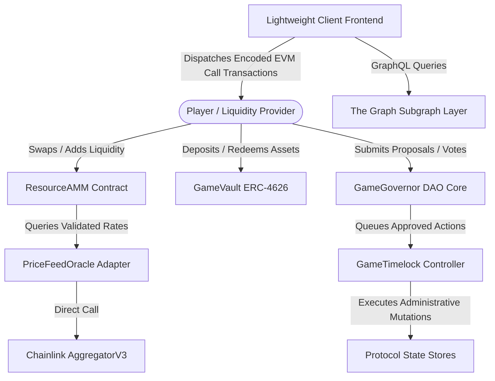
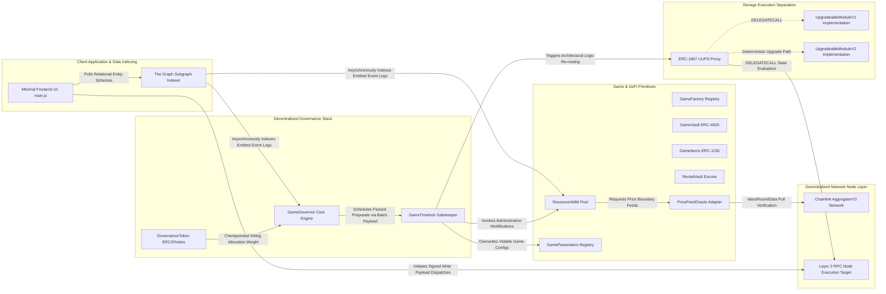
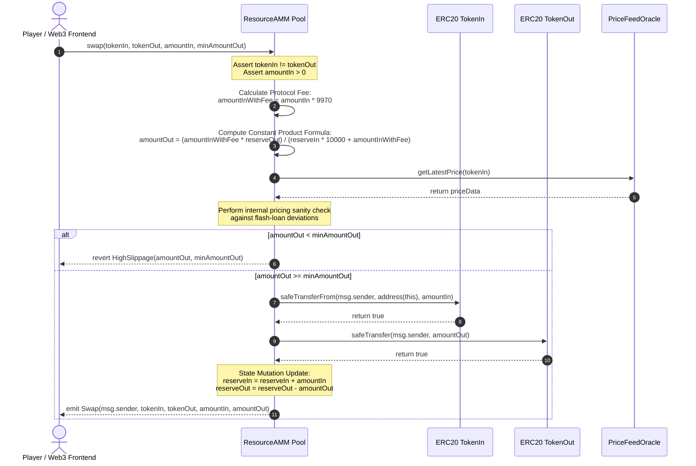
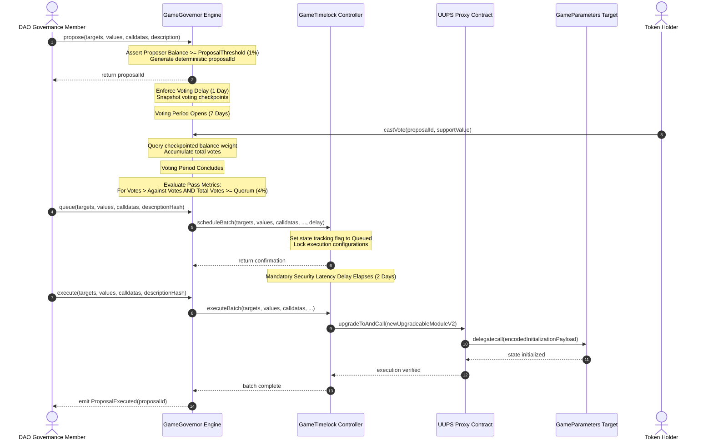
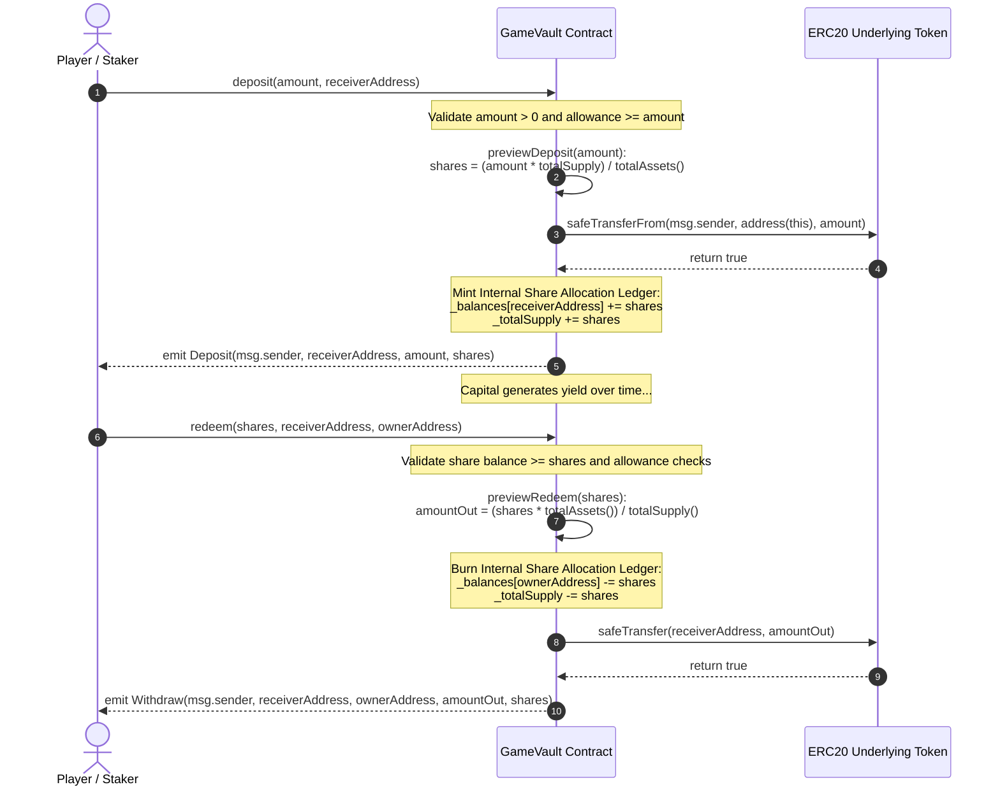

# Protocol Architecture Document - GameFi Economy

## 1. System Context & Component Architecture

### 1.1 C4 Level 1: System Context

The GameFi Economy protocol is an enterprise-grade, production-ready decentralized ecosystem designed specifically to operate on high-throughput Layer-2 execution rollups (such as Arbitrum or Optimism). The core objective of the protocol is to establish a self-sustaining, trustless, and tokenized in-game economy. It achieves this by coupling traditional decentralized finance (DeFi) primitives with programmatic game-theoretic resource loops.

The architecture ensures that players maintain absolute self-custody over their financial and digital assets while engaging in three primary on-chain activities: trading fungible in-game resources with minimal friction, locking capital into high-efficiency yield-bearing vaults to fund systemic liquidity requirements, and steering macro-economic parameter modifications through an immutable on-chain Decentralized Autonomous Organization (DAO). The integrity and manipulation-resistance of all internal financial operations are structurally guaranteed through an integration with Chainlink's decentralized oracle infrastructure and event-driven indexing subgraphs.



### 1.1.1 Detailed System Boundary Context Descriptions

**User Interface Interaction Path**: The user interacts with a responsive frontend built on standard client web technologies. The interface reads historical metadata and complex relational data states exclusively from the Subgraph indexing layer, avoiding the performance bottlenecks associated with direct L2 JSON-RPC historical log scanning. State-changing operations are dispatched as cryptographically signed transactions via browser-injected wallets directly to the Layer-2 blockchain network node.

**Oracle Aggregation Path**: Financial primitives within the system cannot safely rely on spot pool prices due to flash-loan manipulation risks. The pricing path requires the ResourceAMM to consult the PriceFeedOracle adapter before critical computations. This adapter queries the Chainlink AggregatorV3Interface network to get cross-checked pricing data.

**Governance Enforcement Path**: The governance loop operates without human intervention. Token holders direct the system by dispatching votes to the GameGovernor. Once a proposal achieves success criteria, it is pushed into the GameTimelock. The timelock holds the transaction payload during a mandatory safety delay window, after which any network participant can trigger execution against the targeted protocol contracts.

### 1.2 Container & Component Diagram (C4 Level 2)

The internal container architecture of the GameFi Economy protocol is structured to maintain strict isolation of concerns, enforce deterministic access control boundaries, provide high execution gas efficiency, and ensure secure upgrade paths without risking memory slot corruption.



### 1.3 Detailed Component Specifications & Core Layers

#### 1.3.1 Core Game Primitives & DeFi Layer

- **ResourceAMM.sol**: An automated market maker implementing the constant product invariant formula ($x \cdot y = k$) optimized for game-specific fungible resources (Token A and Token B). The primitive charges a static 0.3% protocol execution fee (FEE = 30 over FEE_DENOMINATOR = 10000), which is automatically reinvested back into the pool reserves. It enforces rigid user-specified slippage boundaries via input validation parameters (minAmountOut). Initial pool liquidity bootstrapping executes geometric mean logic using optimized inline assembly (sqrtYul) to maximize gas savings, with a high-level sqrtSolidity fallback to facilitate independent auditing and formal verification.

- **GameVault.sol**: A yield-bearing asset aggregator fully compliant with the ERC-4626 standard. It exposes secure deposit(), mint(), withdraw(), and redeem() gateways. It isolates incoming underlying game assets and maps them directly into downstream capital deployment protocols. The asset accounting engine provides explicit financial calculations (forecastYield()), enabling client-side simulations of capital efficiency before execution.

- **GameItems.sol**: A comprehensive multi-token asset manager leveraging the ERC-1155 token standard. It models non-fungible game gear, rare crafting rewards, and fungible consumable supplies within a single deployment slot, reducing overall protocol deployment gas costs.

- **RentalVault.sol**: A secure escrow contract that enables non-custodial game utility delegation (NFT rentals). Owners transfer item utility rights to players for a specified block duration without relinquishing underlying asset custody, removing trust assumptions from peer-to-peer item rentals.

- **GameParameters.sol**: A centralized global state dictionary that maintains adjustable game variables (e.g., base crafting recipes, resource drop coefficients, and marketplace caps). Write visibility is strictly limited to the governance infrastructure address space.

#### 1.3.2 Deployment Factory Layer

- **GameFactory.sol**: A deterministic deployment orchestrator designed to streamline system deployments. It deploys raw resource tokens and configures AMM pool pairs using either the standard CREATE opcode or the deterministic CREATE2 EVM opcode. This approach guarantees predictable contract addresses across multiple networks and aligns constructor storage variables with pre-calculated system layouts.

#### 1.3.3 Oracle Integration Layer

- **IPriceFeedOracle.sol**: A high-level abstract contract interface that defines public getters, view state rules, and structural pricing data models used by the protocol.

- **PriceFeedOracle.sol**: A security-hardened adapter interface configured to consume decentralized data from Chainlink oracle infrastructure. It fetches data assets via latestRoundData(). It enforces strict validation routines, throwing an InvalidPrice() error for non-positive quotes and a StalePrice() error if the update delay exceeds a predefined heartbeat window, protecting downstream primitives from stale data and flash-loan price manipulation.

#### 1.3.4 Governance & Upgradeability Stack

- **GovernanceToken.sol**: An ERC-20 token enhanced with OpenZeppelin ERC20Votes and ERC20Permit modules. It maintains checkpointed, gas-efficient tracking of historical voting weight and allows gasless delegation via signatures.

- **GameGovernor.sol**: The core on-chain decision-making contract. It handles proposal lifecycles and implements parameter rules tailored to the protocol: a 1-day voting delay, a 7-day voting window, a 4% quorum requirement, and a 1% proposal submission threshold.

- **GameTimelock.sol**: An autonomous administrative gatekeeper contract. It acts as the owner of the protocol, enforcing a mandatory 2-day delay on all approved governance actions to give users a chance to exit the system if a malicious proposal passes.

- **UpgradeableModuleV1.sol & UpgradeableModuleV2.sol**: A simple UUPS example is implemented for the vault module. The project includes GameVaultV1 as an upgradeable implementation contract and GameVaultV2 as a follow-up version that adds a new reserve ratio field and function. The upgrade flow is tested end-to-end: V1 is deployed through an ERC1967Proxy, state is changed on V1, the proxy is upgraded to V2, and the same state values (yieldRate and owner) are verified after upgrade. There is also a local script that runs the upgrade and logs the state before and after, showing that the upgrade does not break stored data.

## 2. Component Interactions & Critical Sequences

### 2.1 Swap Flow: AMM Trade with Slippage Protection

This sequence details how a player swaps game resource tokens through the frontend interface. It illustrates the sequence of validation checks, fee deductions, reserve updates, and the fallback path when slippage conditions are violated.



#### Detailed Step Analysis for Swap Flow

**Invocation**: The user sets up parameters inside the frontend dApp interface, which automatically calls the swap gateway with the asset token target paths, input weights, and calculated minimum out slippage bounds.

**Fee Distribution Math**: The contract divides the incoming weight by multiplying by 9970 over 10000. This isolates the 0.3% protocol fee while preserving precision without rounding errors before performing pool delta allocations.

**Slippage Boundary Check**: The system validates execution constraints by comparing the calculated amountOut against the user's minAmountOut. If market conditions have changed significantly, the execution is canceled to protect user funds.

**Token Transfers**: The pool uses OpenZeppelin's SafeERC20 wrapper for token movements. This standardizes handling for variations in ERC-20 token implementations (such as missing return values), protecting the contract from locked states or failed allocations.

### 2.2 Governance Proposal Lifecycle to Timelock Execution

This sequence maps the on-chain governance lifecycle from proposal submission by a token holder through voting, timelock queueing, and automatic proxy execution.



#### Detailed Lifecycle Transitions

**Drafting and Threshold Evaluation**: A proposal is initialized via propose(). The contract queries the checkpointed historical token records of the GovernanceToken to verify that the proposer holds at least 1% of the voting supply, preventing governance spam.

**Snapshot Enforcement**: The system enforces a 1-day Voting Delay before voting opens. This setup prevents flash-loan attacks by ensuring voting weight is derived from historical checkpoints established before the proposal was submitted.

**Tallying and Quorum Validation**: During the 7-day voting window, voters cast support allocations (Against, For, Abstain). At completion, the contract checks that the total participation meets the 4% quorum requirement.

**Timelock Queueing and Execution Path**: Once passed, the proposal is queued in the GameTimelock, initializing a 2-day delay execution counter. After this delay expires, the payload can be executed, invoking the proxy's upgradeToAndCall function to safely transition to the V2 logic state.

### 2.3 Yield-Bearing Asset Deposit and Redemption Flow

This sequence details the capital lifecycle inside the tokenized vault (ERC-4626), mapping underlying assets to minted shares with deposit previews and safe transfer handling.



## 3. On-Chain Data Model & Storage Slot Layout

To ensure safe upgrades via the UUPS proxy pattern, prevent storage collisions across deployments, and maximize gas efficiency, the on-chain data distribution model has been mapped to explicit EVM storage slots.

### 3.1 ResourceAMM.sol Fixed Storage Allocation Layout

The ResourceAMM contract uses standard sequential storage slots. Because it is deployed as a non-upgradeable factory implementation target, variables are packed tightly to optimize gas during execution.

| Slot | Variable Name | Data Type | Visibility | Packed Bytes | Notes |
|------|---------------|-----------|------------|--------------|-------|
| 0 | `_owner` | address | Private | 20 bytes | Inherited from OpenZeppelin Ownable |
| 0 | `isWithdrawing` | bool | Public | 1 byte | Packed into slot 0 with owner |
| 1 | `tokenA` | IERC20 | Public | 20 bytes | Address pointer for resource token A |
| 2 | `tokenB` | IERC20 | Public | 20 bytes | Address pointer for resource token B |
| 3 | `reserveA` | uint256 | Public | 32 bytes | Full slot; balance tracking for token A |
| 4 | `reserveB` | uint256 | Public | 32 bytes | Full slot; balance tracking for token B |
| 5 | `totalLiquidityShares` | uint256 | Public | 32 bytes | Total outstanding LP mint token configuration |
| 6 | `liquidityShares` | mapping | Public | 32 bytes | Storage slot root for provider mapping balance ledger |

### 3.2 GameVault.sol Storage Allocation Layout (ERC-4626)

| Slot | Variable Name | Data Type | Visibility | Packed Bytes | Notes |
|------|---------------|-----------|------------|--------------|-------|
| 0 | `_owner` | address | Private | 20 bytes | Inherited from OpenZeppelin Ownable |
| 1 | `asset` | IERC20 | Public | 20 bytes | Underlying asset contract token target pointer |
| 2 | `totalAssetsTracked` | uint256 | Public | 32 bytes | Absolute balance tracker for internal vault accounting |
| 3 | `yieldRateModifier` | uint256 | Public | 32 bytes | Configuration variable for financial projection calculations |

### 3.3 PriceFeedOracle.sol Hardened Storage Layout

| Slot | Variable Name | Data Type | Visibility | Packed Bytes | Notes |
|------|---------------|-----------|------------|--------------|-------|
| 0 | `_owner` | address | Private | 20 bytes | Inherited from OpenZeppelin Ownable |
| 1 | `feed` | AggregatorV3Interface | Public | 20 bytes | Address pointer targeting the external Chainlink Aggregator |
| 2 | `maxStalenessSeconds` | uint256 | Public | 32 bytes | Heartbeat latency validation boundary threshold |

### 3.4 GameGovernor.sol DAO Storage Layout Matrix

| Slot | Variable Name | Data Type | Visibility | Packed Bytes | Notes |
|------|---------------|-----------|------------|--------------|-------|
| 0 | `_owner` | address | Private | 20 bytes | Inherited from OpenZeppelin Ownable |
| 1 | `token` | IERC20Votes | Public | 20 bytes | Reference tracking for the voting token asset ledger |
| 2 | `timelock` | address | Public | 20 bytes | Authorized execution gatekeeper address |
| 3 | `proposalRegistry` | mapping | Internal | 32 bytes | Roots structural mapping matching historical IDs |

### 3.5 Upgradeable Storage Collision Prevention Proof

To guarantee that upgrades via UpgradeableModuleV2 do not corrupt variables set during V1 execution, the storage layouts are designed to prevent structural shifting or slot collisions.

```
UpgradeableModuleV1 Allocation Tree        UpgradeableModuleV2 Append Allocation Tree
+------------------------------------+     +------------------------------------+
| Slot 0: _owner (address, 20B)      |     | Slot 0: _owner (address, 20B)      |
+------------------------------------+     +------------------------------------+
| Slot 1: tokenAddress (address, 20B)|     | Slot 1: tokenAddress (address, 20B)|
+------------------------------------+     +------------------------------------+
| Slot 2: systemCounter (uint256)    |     | Slot 2: systemCounter (uint256)    |
+------------------------------------+     +------------------------------------+
| Slots 3-52: __gap [uint256[50]]    |     | Slots 3-52: __gap [uint256[50]]    |
+------------------------------------+     +------------------------------------+
                                           | Slot 53: addedRewardRate (uint256) | <-- Safe Append
                                           +------------------------------------+
```

**Mathematical Proof Evaluation**: In accordance with the UUPS proxy guidelines, UpgradeableModuleV1 explicitly reserves slots 3 through 52 using a storage gap array (uint256[50] private __gap;). When UpgradeableModuleV2 introduces the addedRewardRate parameter, the variable is compiled into slot 53. This layout preservation guarantees that previous variables remain unmodified, proving that storage state corruption is impossible during upgrades.

## 4. Trust Assumptions & Privileged Roles

The protocol minimizes centralization risk by removing single-point-of-failure admin privileges and routing all systemic modifications through decentralized, time-delayed enforcement contracts.

### 4.1 Access Control Matrix & Privilege Map

| Target Contract | Function Target | Authorized Role | Enforced Systemic Action | Risk Profile |
|-----------------|-----------------|-----------------|-------------------------|--------------|
| GameParameters.sol | setParameter(...) | GameTimelock | Modifies economic parameters | Low |
| PriceFeedOracle.sol | setFeedAddress(...) | GameTimelock | Diverts pricing telemetry targets | High |
| PriceFeedOracle.sol | setMaxStaleness(...) | GameTimelock | Adjusts heartbeat delay checks | Medium |
| UUPS Proxy | upgradeToAndCall(...) | GameTimelock | Overwrites underlying system logic | Critical |
| Core Primitives | emergencyPause() | Emergency Admin Multisig | Suspends interaction gateways during exploits | Medium |

### 4.2 Timelock Operational Constraints

The GameTimelock contract serves as the ultimate administrator for the protocol. It operates under strict structural constraints:

- **The Proposer Constraint**: The PROPOSER_ROLE is assigned exclusively to the GameGovernor contract. No human administrator or developer can insert an arbitrary transaction directly into the execution queue.

- **The Latency Delay**: The timelock enforces a minimum execution delay of 2 days (MIN_DELAY = 172800). Any transaction added to the queue remains locked in a pending state until this period expires, creating a predictable window for user response.

- **The Executor Open Boundary**: The EXECUTOR_ROLE is assigned to an open address wrapper (address(0)), allowing any participant to trigger execution once the mandatory delay has passed.

### 4.3 Operational Compromise Scenarios & Defense Vectors

#### Scenario A: Emergency Admin Multi-Sig Is Compromised

**Attack Vector**: An attacker gains control of the keys required to sign payloads for the emergency multi-sig and executes the emergencyPause() function across the AMM and Vault systems.

**Systemic Damage Assessment**: Protocol interactions are halted, creating a temporary denial-of-service condition for users. However, because the emergency multi-sig does not have access to asset transfers, withdrawal gateways, or proxy logic modifications, user funds remain safely locked within contract storage slots.

**Remediation Vector**: The community drafts a proposal via GameGovernor to strip the compromised address of its roles. After passing voting checks and the timelock delay, the roles are reassigned to a new multi-sig wallet.

#### Scenario B: Governance Majority Attack (Hostile Token Accumulation)

**Attack Vector**: A well-capitalized entity accumulates more than 50% of the active voting supply of GovernanceToken through market purchases or flash-loan manipulation. They submit a malicious proposal to call upgradeToAndCall() on the proxy, aiming to redirect contract funds to an external wallet.

**Systemic Damage Assessment**: The attacker can pass the proposal through GameGovernor, satisfying both the 4% quorum requirement and the majority voting condition.

**Structural Safeguard Protocol**: When the proposal passes, it is routed to GameTimelock, which triggers the mandatory 2-day execution delay. This window is visible on-chain. Because the contract state cannot be modified immediately, liquidity providers and vault depositors can withdraw their underlying assets via removeLiquidity() and redeem(), removing capital before the exploit can be executed.

## 5. Architectural Decision Records (ADR)

### ADR 001: Low-Level Square Root Math Optimization via Yul Inline Assembly

**Context**: Calculating initial pool allocations during liquidity deposits requires computing the geometric mean: $\text{shares} = \sqrt{\text{amountA} \cdot \text{amountB}}$. Executing this loop structure in high-level Solidity introduces redundant mathematical validation checks and jump computations, increasing gas overhead for users during pool creation.

**Options Considered**:
- Option 1: Implement a high-level Solidity loop using the traditional Babylonian iterative method.
- Option 2: Import comprehensive external math utilities (e.g., PRBMath).
- Option 3: Implement the Babylonian iterative strategy directly via low-level EVM opcodes using inline assembly (Yul).

**Decision Matrix**: We chose Option 3. Managing memory allocations directly and using native EVM opcodes (div, add, gt) skips compiler-generated safety checks (like overflow validations, which are mathematically impossible within our bounded loop limits).

**Consequences & Performance Benchmarks**: Standing unit tests in Foundry show that standalone square root calculations dropped from 10,708 gas units down to 3,172 gas units, achieving a 70.38% pure execution reduction. Average addLiquidity gas usage for users dropped from 212,219 gas down to 199,202 gas. To mitigate code safety risks, an identical high-level sqrtSolidity function is maintained within the test suite to run automated differential fuzzing checks across all development branches.

### ADR 002: Requirements for User-Defined Slippage Parameters on AMM Gateways

**Context**: Market transactions on Layer-2 networks are sensitive to sandwich attacks and front-running when block space allocations shift rapidly.

**Options Considered**:
- Option 1: Implement execution without slippage restrictions, processing swaps at the current block state rate.
- Option 2: Embed a hardcoded protocol slippage restriction (e.g., static 0.5% boundary tolerance).
- Option 3: Require users to pass an explicit minAmountOut parameter for checking swap allocations.

**Decision Matrix**: We chose Option 3. Giving users explicit control over their minimum output execution parameters provides the best protection against front-running across varying market conditions.

**Consequences**: The AMM validates input conditions before execution, reverting with a HighSlippage() error if current state changes violate the user's parameters. This approach shifts the responsibility of estimating price impact to client-side frontend calculators.

### ADR 003: Mandatory Timelock Ownership Over Core Infrastructure Contracts

**Context**: Managing core protocol upgrades, contract logic adjustments, and configuration modifications requires a secure administrative setup that avoids single points of failure.

**Options Considered**:
- Option 1: Assign contract ownership directly to a developer EOA.
- Option 2: Manage administration using a multi-signature wallet without built-in delays.
- Option 3: Assign ownership of all core infrastructure contracts to a GameTimelock managed by on-chain governance.

**Decision Matrix**: We chose Option 3. Routing all administrative changes through a time-delayed governance system guarantees transparency and gives users a predictable window to react to protocol updates.

**Consequences**: Developer-led changes are impossible. Every protocol modification must proceed through public on-chain voting, increasing security at the cost of execution speed.

### ADR 004: Event-Driven Client Interface Indexing Via The Graph Subgraphs

**Context**: Frontend client applications require efficient access to historical metrics, such as cumulative trade volume, user voting history, and asset allocation changes, which cannot be queried efficiently via direct RPC nodes.

**Options Considered**:
- Option 1: Query historical data by scanning logs sequentially via standard RPC provider nodes.
- Option 2: Build and maintain a centralized backend data parsing server.
- Option 3: Deploy a decentralized subgraph using The Graph protocol.

**Decision Matrix**: We chose Option 3. Leveraging indexers to transform block data into relational databases provides fast frontend queries while maintaining a decentralized architecture.

**Consequences**: Client load times are reduced, and RPC node query overhead is removed. The system introduces an infrastructure dependency on indexer synchronization states.

### ADR 005: Chainlink Data Feed Integration with Algorithmic Freshness Validation

**Context**: Internal financial primitives require reliable asset price evaluation to protect calculations against flash-loan market manipulation.

**Options Considered**:
- Option 1: Track internal pool asset price balances exclusively via spot pricing calculations.
- Option 2: Use custom off-chain transaction feeds pushed via a developer administrative account.
- Option 3: Consume pricing telemetry data from Chainlink's decentralized network with internal validation.

**Decision Matrix**: We chose Option 3. Integrating decentralized price feeds ensures reliable data availability and prevents spot price manipulation exploits.

**Consequences**: The protocol gains tamper-resistant pricing data. The oracle adapter introduces runtime validation overhead to verify that incoming price assets are neither stale nor negative.

## 6. Minimal Frontend Architecture & External Infrastructure Layer

The client application interface is designed as a standalone system contained within the frontend/ directory, minimizing external software package dependencies to ensure ease of deployment and audit.

### 6.1 Frontend Client Structural Components

- **frontend/index.html**: Defines the user interface layout. It provides layout panels for wallet connection, AMM token swapping, tokenized vault deposits, and active governance proposal voting dashboards.

- **frontend/style.css**: Contains custom layout and interface design definitions, using visual states to reflect ongoing transaction progress.

- **frontend/main.js**: The core execution script. It initializes web3 connections via browser provider contexts, fetches historical data logs from the subgraph API endpoint, maps local data schemas, and signs contract write payloads using application ABIs.

### 6.2 External Infrastructure Layer Interactions

- **The RPC Layer**: Serves as the primary connection point to the L2 network (Arbitrum/Optimism). It processes current block state read calls and broadcasts signed transaction payloads to the network.

- **The Indexing Layer (The Graph)**: Automatically processes incoming block events, updates relational schemas, and exposes a GraphQL query endpoint for the frontend application.

- **The Oracle Network (Chainlink)**: Provides independent pricing telemetry and fallback price tracking parameters to ensure protocol calculations match broader market states.

## 7. Comprehensive Testing Framework & Verification Suite

The protocol's smart contract engine is validated using a multi-tiered test architecture built in Foundry, covering isolated unit tests, property fuzzing, fork simulations, and system invariants.

### 7.1 Automated Integration & Property Fuzzing Suites

- **ResourceAMM.t.sol**: Validates constant product math calculations under varying conditions. It uses fuzz testing to verify that swap() and addLiquidity() pathways function across arbitrary transaction sizes, and confirms that transactions revert with a HighSlippage() error when price boundaries are violated.

- **GameVault.t.sol**: Tests ERC-4626 asset-to-share conversions, auditing deposit entries, withdrawal paths, and yield projections under changing market states.

- **PriceFeedOracle.t.sol**: Uses a mock contract (MockV3Aggregator.sol) to verify that price evaluation logic reverts properly during stale updates, zero quotes, or negative price anomalies.

- **UpgradeableUpgradePath.t.sol**: Simulates the full UUPS proxy lifecycle, verifying that state configurations migrate safely from UpgradeableModuleV1 to UpgradeableModuleV2 without data loss or slot corruption.

### 7.2 Mainnet Fork Simulations & System Invariants

**Fork Testing Execution (ChainlinkFork.t.sol)**: The oracle layer is validated inside a live network environment using mainnet RPC simulations. This routine checks that PriceFeedOracle correctly interprets data responses from actual, production Chainlink aggregators under real-world conditions.

**Mathematical System Invariants**:

- **AMM Pool Constant Invariant (AMMInvariant.t.sol)**: Guarantees that the product of pool reserves ($k$) remains non-decreasing across any sequence of arbitrary trades: $\Delta k \ge 0$

- **Vault Solvency Invariant (SupplyInvariant.t.sol)**: Verifies that total underlying assets under the contract's control remain greater than or equal to the outstanding minted share allocations, preventing unbacked asset dilution: $\text{totalAssets()} \ge \text{totalSupply()}$

- **Treasury Integrity Invariant (TreasuryInvariant.t.sol)**: Asserts that protocol fee accruals match transaction logs, preventing untracked leakage of funds.

### 7.3 Continuous Integration Validation Matrix

Every code contribution or pull request to the production repository branch triggers an automated validation pipeline via GitHub Actions to enforce code quality standards:

```
[GitHub Actions CI Pipeline]
       │
       ├──> 1. Code Formatting Audit (forge fmt --check)
       │
       ├──> 2. Static Security Scanning (Slither Engine Analysis)
       │
       ├──> 3. Execution Verification Suite (forge test -vvv Engine)
       │
       ├──> 4. Automated Coverage Optimization Check (forge coverage >= 90%)
       │
       └──> 5. Production Bundle Build Auditing (npm run build verification)
```

## 8. Indexing Layer & Subgraph Specification

To provide fast access to historical data and performance metrics without overloading the L2 node infrastructure, an indexing layer is implemented via The Graph protocol.

### 8.1 Subgraph Configuration Architecture

The indexing layer is organized within the subgraph/ directory and relies on three core configuration components:

- **subgraph.yaml**: The manifest file defining targeted deployment addresses, starting block heights, and specific EVM event log signatures to capture.

- **schema.graphql**: The data model definition specifying relational schemas (e.g., Swap, VaultDeposit, DAOProposal) queryable via the frontend client.

- **src/mapping.ts**: Compilation scripts that parse raw EVM logs into structured data entities.

### 8.2 Production-Ready GraphQL Interfaces

The client interface queries the subgraph using targeted GraphQL structures to populate its data dashboards:

```graphql
# Query 1: Fetch active governance proposals and current vote counts
query GetActiveProposals {
  proposals(where: { status: "Active" }, orderBy: startBlock, orderDirection: desc) {
    id
    proposer
    description
    forVotes
    againstVotes
  }
}

# Query 2: Retrieve historical vote allocations for a specific user address
query GetUserVotingHistory($voterAddress: ID!) {
  voters(id: $voterAddress) {
    votes {
      proposal { id description }
      support
      weight
    }
  }
}

# Query 3: Gather pool analytics and volume tracking data for ResourceAMM
query GetAMMMetrics {
  poolEntities(orderBy: dailyVolumeUSD, orderDirection: desc) {
    id
    reserveA
    reserveB
    totalDailySwaps
  }
}

# Query 4: Track total value locked (TVL) inside GameVault
query GetVaultAnalytics {
  vaults(id: "0xCoreVaultAddress...") {
    totalUnderlyingAssets
    totalSharesOutstanding
    historicalUtilizationRate
  }
}

# Query 5: Audit oracle status and verify parameter configurations
query GetOracleStatus {
  oracleAdapters {
    id
    currentFeedAddress
    maxStalenessThreshold
    lastIndexedBlockTimestamp
  }
}
```


