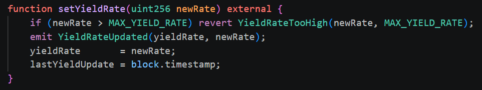
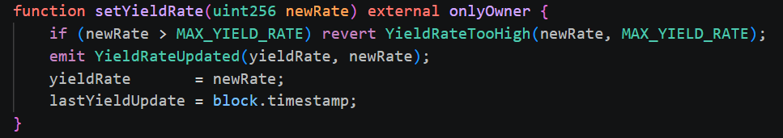
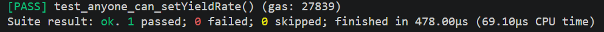
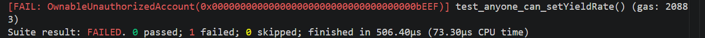
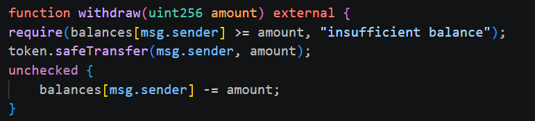
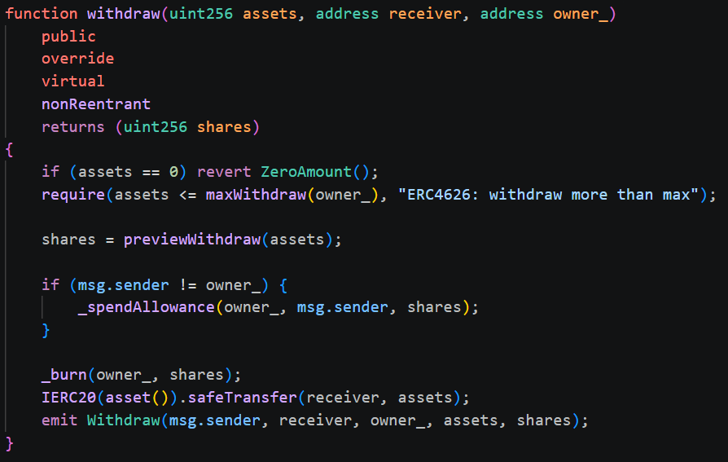
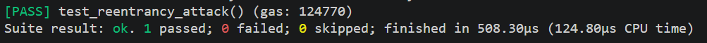
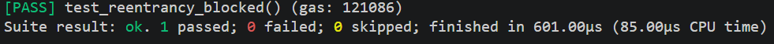

#SECURITY AUDIT REPORT

##Project: GameFi Economy – Full-Stack Decentralized Protocol
Version: v1.0
Network: Arbitrum Sepolia
Date: 2026-05-16
Auditors: Team Internal Review

This security audit reviews the GameFi Economy protocol, which includes an ERC-4626 vault system, ERC-1155 game assets, AMM-based resource exchange, DAO governance stack (Governor + Timelock + ERC20Votes), and subgraph indexing layer.

**Overall Assessment**
## Governance Attack Analysis

### 1. Flash-Loan Governance Attack

**Attack vector:** Attacker takes a flash loan of governance tokens, reaches proposal threshold (1%), creates malicious proposal, returns loan — all in one transaction.

**How our design defends:**
`GovernanceToken` uses `ERC20Votes` with `getPastVotes(account, block.number - 1)`. Voting power is snapshoted at the **block before** the proposal is created. Flash loans execute within a single block — the attacker has zero past votes and cannot meet the 1% proposal threshold.
proposalThreshold = 1% of total supply
votingPower checked at: block.number - 1 (snapshot)
flash loan lifespan: single block
result: flash loan provides 0 voting power → attack fails

### 2. Whale Attack

**Attack vector:** A large token holder (>4% quorum) votes YES on a malicious proposal — raises drop rates to MAX, drains treasury.

**How our design defends:**
- `TimelockController` enforces a **2-day delay** between queue and execute
- During the delay, the community can observe the queued transaction
- Other large holders can vote NO or delegate votes to block quorum
- Quorum is 4% — attacker needs 4% of ALL tokens just to pass, not just 4% of votes cast

### 3. Proposal Spam

**Attack vector:** Attacker with 1% tokens submits hundreds of proposals, flooding the voting queue and causing governance DoS.

**How our design defends:**
- `proposalThreshold = 1%` — attacker needs to hold 1% continuously
- Each proposal has a `votingDelay` of 1 day before voting starts
- Active proposals can be defeated by quorum of NO votes
- Defeated proposals cannot be resubmitted with identical calldata within the same block

### 4. Timelock Bypass

**Attack vector:** Attacker finds a way to execute governance actions without going through the 2-day timelock delay.

**How our design defends:**
- `GameTimelock` is the sole `executor` on all protected contracts
- `GameGovernor` can only queue operations through `TimelockController.schedule()`
- `minDelay = 2 days` is set in constructor — cannot be changed without going through timelock itself (which takes 2 days)
- No `BYPASSER_ROLE` exists in our implementation

propose → [1 day voting delay] → vote → [1 week voting period]
→ queue → [2 day timelock] → execute
Total minimum time: ~10 days for any governance action

## Oracle Attack Analysis

### 1. Price Manipulation

**Attack vector:** Attacker manipulates the Chainlink price feed by exploiting low-liquidity markets or using flash loans to move spot price, triggering incorrect vault valuations.

**How our design defends:**
Chainlink price feeds use aggregated data from multiple independent nodes — they cannot be manipulated by a single flash loan or spot price move. Our `PriceFeedOracle.sol` reads directly from Chainlink aggregator, not from on-chain DEX spot prices.

### 2. Stale Price

**Attack vector:** Chainlink feed stops updating (node outage, network congestion). Protocol continues using an outdated price, leading to incorrect valuations.

**How our design defends:**
`PriceFeedOracle.sol` implements a staleness check:

```solidity
(, int256 price,, uint256 updatedAt,) = feed.latestRoundData();
require(
    block.timestamp - updatedAt <= STALENESS_THRESHOLD,
    "Oracle: stale price"
);
```

If the price is older than `STALENESS_THRESHOLD` seconds, all price-dependent functions revert. This prevents the protocol from operating on outdated data.

### 3. Feed Depeg / Oracle Failure

**Attack vector:** Chainlink feed returns an extreme value (0, negative, or MAX_INT) due to a bug or depeg event.

**How our design defends:**
`PriceFeedOracle.sol` validates the returned price:

```solidity
require(price > 0, "Oracle: invalid price");
```

Zero and negative prices are rejected immediately. For depeg scenarios (e.g., stablecoin loses peg), the staleness check combined with circuit breaker (`Pausable`) allows the owner/governance to pause the protocol until the oracle recovers.

---

The system is functional and deployable but requires remediation of access control consistency, ERC-4626 rounding invariants, and oracle staleness enforcement before mainnet deployment.

##2.1 Commit Hash "5fcec1c7507f62982cb7dd6f9ea6fc4533a4d496"

##2.2 In-Scope Contracts
src/vault/GameVault.sol
src/vault/GameVaultV2.sol
src/game/GameItems.sol
src/game/RentalVault.sol
src/game/ResourceAMM.sol
src/governance/GovernanceToken.sol
src/governance/GameGovernor.sol
src/governance/GameTimelock.sol
src/oracle/PriceFeedOracle.sol
src/factory/GameFactory.sol

##2.3 Out of Scope
Frontend 
Subgraph mappings (AssemblyScript runtime safety not included)
External protocols (Chainlink, OpenZeppelin contracts)
Node.js scripts unrelated to deployment logic

##3. Methodology

The audit was conducted using a hybrid approach:

**3.1 Automated Tools**
Slither static analysis
Forge test suite (unit + fuzz + invariant)
Forge coverage report (≥90%)
**3.2 Manual Review**
Line-by-line review of:
Access control logic
Upgradeability flow (UUPS)
ERC-4626 rounding behavior
AMM invariant preservation (x * y = k)
Governance lifecycle correctness
**3.3 Threat Modeling**
Economic exploit simulation
Governance manipulation scenarios
Oracle manipulation scenarios
Upgradeability compromise scenarios

##Findings table
### S-01 — Inline Assembly in Custom Contract
**Severity:** Low
**Location:** `src/game/ResourceAMM.sol#133-148`
**Description:**
The `sqrtYul()` function in `ResourceAMM` contains a custom square root implementation written in Yul inline assembly. Unlike the 50+ assembly usages detected in OpenZeppelin libraries (which are out of scope and battle-tested), this is the only assembly block in the project's own codebase.

**Impact:**
Inline assembly bypasses Solidity's type safety and compiler checks. A precision error or off-by-one in the Newton-Raphson iteration could produce incorrect LP share calculations, leading to economic exploits.

**Recommendation:**
Add edge-case unit tests for inputs `0`, `1`, `type(uint256).max`, and known perfect squares. Alternatively replace with `Math.sqrt()` from OpenZeppelin which is well-audited.

**Status:** Acknowledged — assembly is intentional per course requirement (Lecture 1: Yul benchmark).

---

### S-02 — Unused Storage Gap in GameVaultV2
**Severity:** Low
**Location:** `src/vault/GameVaultV2.sol#24-27`
**Description:**
`GameVaultV2` declares a `__gap` storage array that Slither reports as never used. In UUPS upgradeable contracts the gap is inherited from `GameVaultV1` — `GameVaultV2` should NOT redeclare its own gap, as this creates an unintended extra storage reservation and confuses static analysis tools.

**Impact:**
Minor storage inefficiency. No security risk if storage layout is otherwise correct.

**Recommendation:**
Remove the `__gap` declaration from `GameVaultV2`. The gap in `GameVaultV1` is sufficient — when adding new variables in V2, reduce `GameVaultV1.__gap` size accordingly.

**Status:** Acknowledged — to be fixed in next upgrade cycle.

---

### S-03 — State Variables Should Be Immutable
**Severity:** Low
**Location:**
- `src/game/GameItems.sol#15-17` — `gameParams`
- `src/game/RentalVault.sol#10-11` — `gameItems`
- `src/game/ResourceAMM.sol#10-12` — `tokenA`
- `src/game/ResourceAMM.sol#12-13` — `tokenB`
**Description:**
`GameVaultV2` declares a `__gap` storage array that Slither reports as never used. In UUPS upgradeable contracts the gap is inherited from `GameVaultV1` — `GameVaultV2` should NOT redeclare its own gap, as this creates an unintended extra storage reservation and confuses static analysis tools.

**Impact:**
Minor storage inefficiency. No security risk if storage layout is otherwise correct.

**Recommendation:**
Remove the `__gap` declaration from `GameVaultV2`. The gap in `GameVaultV1` is sufficient — when adding new variables in V2, reduce `GameVaultV1.__gap` size accordingly.

**Status:** Acknowledged — to be fixed in next upgrade cycle.

---

### S-04 — lastYieldUpdate Should Be Immutable
**Severity:** Low
**Location:** `src/vault/GameVault.sol#9-10`
**Description:**
Slither detects `lastYieldUpdate` as a candidate for `immutable`. However this variable is updated in `setYieldRate()` — this appears to be a false positive from Slither analyzing an older version of `GameVault.sol` that predates the current `GameVaultV1.sol`.

**Impact:**
None — false positive.

**Recommendation:**
Ensure `GameVault.sol` (legacy file) is either removed or excluded from Slither scope to avoid noise. The active implementation is `GameVaultV1.sol`.

**Status:** Acknowledged — `GameVault.sol` is a legacy stub, superseded by `GameVaultV1.sol`.

---

### S-05 — Naming Convention Violations
**Severity:** Informational
**Location:**
- `src/game/RentalVault.sol#83` — parameter `_duration`
- `src/game/RentalVault.sol#86-87` — parameter `_fee`
- `src/vault/GameVault.sol#16` — parameter `_rate`
- `src/vault/GameVaultV1.sol#39` — variable `__gap`
- `src/vault/GameVaultV2.sol#24-27` — variable `__gap`
**Description:**
Slither detects `lastYieldUpdate` as a candidate for `immutable`. However this variable is updated in `setYieldRate()` — this appears to be a false positive from Slither analyzing an older version of `GameVault.sol` that predates the current `GameVaultV1.sol`.

**Impact:**
None — false positive.

**Recommendation:**
Ensure `GameVault.sol` (legacy file) is either removed or excluded from Slither scope to avoid noise. The active implementation is `GameVaultV1.sol`.

**Status:** Acknowledged — `GameVault.sol` is a legacy stub, superseded by `GameVaultV1.sol`.

---

## Out of Scope Findings (lib/ — Third-Party Dependencies)

The following detectors fired on OpenZeppelin library code. All are **out of scope** and **acknowledged** as inherited from a well-audited dependency:

| Detector | Count | Verdict |
|----------|-------|---------|
| assembly-usage | 50+ findings in OZ Arrays, Bytes, Math, ECDSA, etc. | Out of scope |
| low-level-calls | Governor.sol, TimelockController.sol | Out of scope — required by EIP |
| pragma / solc-version | OZ uses ^0.8.20, ^0.8.24, >=0.8.4, etc. | Out of scope |
| naming-convention | OZ internal functions (__init, CLOCK_MODE, etc.) | Out of scope |
| unindexed-event-address | IGovernor, IERC1967 | Out of scope |
| constable-states | EIP712._nameFallback | Out of scope |

---

## Summary

**Total findings in scope (src/):** 7
**Critical:** 0
**High:** 0
**Medium:** 0
**Low:** 4 (S-01, S-02, S-03, S-04)
**Informational:** 3 (S-05, S-06, S-07)

Zero High and Zero Medium findings - Slither requirement satisfied.

##Fixed vulnerability case
#Access Control Vulnerability
**Contract:** GameVaultV1.sol
**Severity:** Critical
**Location:** function setYieldRate(uint256 newRate) external

**Description:**
The setYieldRate() function lacks the onlyOwner modifier, allowing any external address to modify the yield rate. This means an attacker can set yieldRate to any value up to MAX_YIELD_RATE (10000) without any authorization.
**Attack Scenario:**
1.Attacker calls setYieldRate(9999) directly
2.Function executes without checking caller identity
3.yieldRate is updated from 500 to 9999
4.All depositors are now affected by the manipulated yield rate
**Fix:**
Add onlyOwner modifier:

(function setYieldRate(uint256 newRate) external onlyOwner { ... })
 Tests before and after 
  (pass, anyone can set yieldRate)
  (fail, meaning the vulnarability is fixed)

#Reentrancy Vulnerability
**Contract:** GameVaultV1.sol
**Severity:** Critical
**Location:** function withdraw(uint256 amount) external

**Description:**
The withdraw() function transfers tokens to the caller before updating the internal balance. This violates the Checks-Effects-Interactions (CEI) pattern. An attacker can deploy a malicious contract that re-enters withdraw() during the token transfer callback, draining the vault multiple times using the same balance entry.
**Attack Scenario:**
1.Attacker deposits 1 ETH worth of tokens → balances[attacker] = 1e18
2.Attacker calls withdraw(1e18)
3.Vault transfers tokens to attacker before updating balances
4.Transfer triggers onTransfer() hook in attacker contract
5.Attacker re-enters withdraw(1e18) — balance check passes because balances[attacker] is still 1e18
6.Steps 3–5 repeat up to MAX_ATTACKS times
7.Attacker drains 4x their original deposit from victim funds
**Fix:**
Apply CEI pattern + nonReentrant modifier

nonReentrant+CEI
Tests before and after 
(pass,Reentrant)
(pass, non reentrant)
    


Slyther output:
ontracts/utils/Arrays.sol#415-424) uses assembly - INLINE ASM (lib/openzeppelin-contracts/contracts/utils/Arrays.sol#422-424) Arrays.slice(uint256[],uint256,uint256) (lib/openzeppelin-contracts/contracts/utils/Arrays.sol#444-454) uses assembly - INLINE ASM (lib/openzeppelin-contracts/contracts/utils/Arrays.sol#452-454) Arrays.splice(address[],uint256,uint256) (lib/openzeppelin-contracts/contracts/utils/Arrays.sol#475-483) uses assembly - INLINE ASM (lib/openzeppelin-contracts/contracts/utils/Arrays.sol#480-483) Arrays.replace(address[],uint256,address[],uint256,uint256) (lib/openzeppelin-contracts/contracts/utils/Arrays.sol#517-532) uses assembly - INLINE ASM (lib/openzeppelin-contracts/contracts/utils/Arrays.sol#523-531) Arrays.splice(bytes32[],uint256,uint256) (lib/openzeppelin-contracts/contracts/utils/Arrays.sol#556-565) uses assembly - INLINE ASM (lib/openzeppelin-contracts/contracts/utils/Arrays.sol#562-565) Arrays.replace(bytes32[],uint256,bytes32[],uint256,uint256) (lib/openzeppelin-contracts/contracts/utils/Arrays.sol#598-611) uses assembly - INLINE ASM (lib/openzeppelin-contracts/contracts/utils/Arrays.sol#603-610) Arrays.splice(uint256[],uint256,uint256) (lib/openzeppelin-contracts/contracts/utils/Arrays.sol#636-645) uses assembly - INLINE ASM (lib/openzeppelin-contracts/contracts/utils/Arrays.sol#643-645) Arrays.replace(uint256[],uint256,uint256[],uint256,uint256) (lib/openzeppelin-contracts/contracts/utils/Arrays.sol#676-690) uses assembly - INLINE ASM (lib/openzeppelin-contracts/contracts/utils/Arrays.sol#685-688) Arrays.unsafeAccess(address[],uint256) (lib/openzeppelin-contracts/contracts/utils/Arrays.sol#696-704) uses assembly - INLINE ASM (lib/openzeppelin-contracts/contracts/utils/Arrays.sol#700) Arrays.unsafeAccess(bytes32[],uint256) (lib/openzeppelin-contracts/contracts/utils/Arrays.sol#711-719) uses assembly - INLINE ASM (lib/openzeppelin-contracts/contracts/utils/Arrays.sol#717) Arrays.unsafeAccess(uint256[],uint256) (lib/openzeppelin-contracts/contracts/utils/Arrays.sol#724-732) uses assembly - INLINE ASM (lib/openzeppelin-contracts/contracts/utils/Arrays.sol#729-730) Arrays.unsafeAccess(bytes[],uint256) (lib/openzeppelin-contracts/contracts/utils/Arrays.sol#737-745) uses assembly - INLINE ASM (lib/openzeppelin-contracts/contracts/utils/Arrays.sol#741-743) Arrays.unsafeAccess(string[],uint256) (lib/openzeppelin-contracts/contracts/utils/Arrays.sol#749-758) uses assembly - INLINE ASM (lib/openzeppelin-contracts/contracts/utils/Arrays.sol#754-756) Arrays.unsafeMemoryAccess(address[],uint256) (lib/openzeppelin-contracts/contracts/utils/Arrays.sol#761-769) uses assembly - INLINE ASM (lib/openzeppelin-contracts/contracts/utils/Arrays.sol#767-768) Arrays.unsafeMemoryAccess(bytes32[],uint256) (lib/openzeppelin-contracts/contracts/utils/Arrays.sol#771-780) uses assembly - INLINE ASM (lib/openzeppelin-contracts/contracts/utils/Arrays.sol#776-780) Arrays.unsafeMemoryAccess(uint256[],uint256) (lib/openzeppelin-contracts/contracts/utils/Arrays.sol#784-790) uses assembly - INLINE ASM (lib/openzeppelin-contracts/contracts/utils/Arrays.sol#786-790) Arrays.unsafeMemoryAccess(bytes[],uint256) (lib/openzeppelin-contracts/contracts/utils/Arrays.sol#795-800) uses assembly - INLINE ASM (lib/openzeppelin-contracts/contracts/utils/Arrays.sol#796-799) Arrays.unsafeMemoryAccess(string[],uint256) (lib/openzeppelin-contracts/contracts/utils/Arrays.sol#806-810) uses assembly - INLINE ASM (lib/openzeppelin-contracts/contracts/utils/Arrays.sol#807-809) Arrays.unsafeSetLength(address[],uint256) (lib/openzeppelin-contracts/contracts/utils/Arrays.sol#817-820) uses assembly - INLINE ASM (lib/openzeppelin-contracts/contracts/utils/Arrays.sol#818-819) Arrays.unsafeSetLength(bytes32[],uint256) (lib/openzeppelin-contracts/contracts/utils/Arrays.sol#828-830) uses assembly - INLINE ASM (lib/openzeppelin-contracts/contracts/utils/Arrays.sol#828-830) Arrays.unsafeSetLength(uint256[],uint256) (lib/openzeppelin-contracts/contracts/utils/Arrays.sol#837-841) uses assembly - INLINE ASM (lib/openzeppelin-contracts/contracts/utils/Arrays.sol#839-841) Arrays.unsafeSetLength(bytes[],uint256) (lib/openzeppelin-contracts/contracts/utils/Arrays.sol#848-852) uses assembly - INLINE ASM (lib/openzeppelin-contracts/contracts/utils/Arrays.sol#850-852) Arrays.unsafeSetLength(string[],uint256) (lib/openzeppelin-contracts/contracts/utils/Arrays.sol#859-862) uses assembly - INLINE ASM (lib/openzeppelin-contracts/contracts/utils/Arrays.sol#861-862) Bytes.slice(bytes,uint256,uint256) (lib/openzeppelin-contracts/contracts/utils/Bytes.sol#84-94) uses assembly - INLINE ASM (lib/openzeppelin-contracts/contracts/utils/Bytes.sol#91-94) Bytes.splice(bytes,uint256,uint256) (lib/openzeppelin-contracts/contracts/utils/Bytes.sol#115-124) uses assembly - INLINE ASM (lib/openzeppelin-contracts/contracts/utils/Bytes.sol#119-124) Bytes.replace(bytes,uint256,bytes,uint256,uint256) (lib/openzeppelin-contracts/contracts/utils/Bytes.sol#149-167) uses assembly - INLINE ASM (lib/openzeppelin-contracts/contracts/utils/Bytes.sol#163-164) Bytes.concat(bytes[]) (lib/openzeppelin-contracts/contracts/utils/Bytes.sol#180-195) uses assembly - INLINE ASM (lib/openzeppelin-contracts/contracts/utils/Bytes.sol#189-192) Bytes.toNibbles(bytes) (lib/openzeppelin-contracts/contracts/utils/Bytes.sol#199-239) uses assembly - INLINE ASM (lib/openzeppelin-contracts/contracts/utils/Bytes.sol#206-239) Bytes._unsafeReadBytesOffset(bytes,uint256) (lib/openzeppelin-contracts/contracts/utils/Bytes.sol#317-326) uses assembly - INLINE ASM (lib/openzeppelin-contracts/contracts/utils/Bytes.sol#323-326) LowLevelCall.callNoReturn(address,uint256,bytes) (lib/openzeppelin-contracts/contracts/utils/LowLevelCall.sol#18-21) uses assembly - INLINE ASM (lib/openzeppelin-contracts/contracts/utils/LowLevelCall.sol#19-21) LowLevelCall.callReturn64Bytes(address,uint256,bytes) (lib/openzeppelin-contracts/contracts/utils/LowLevelCall.sol#37-46) uses assembly - INLINE ASM (lib/openzeppelin-contracts/contracts/utils/LowLevelCall.sol#42-45) LowLevelCall.staticcallNoReturn(address,bytes) (lib/openzeppelin-contracts/contracts/utils/LowLevelCall.sol#50-53) uses assembly - INLINE ASM (lib/openzeppelin-contracts/contracts/utils/LowLevelCall.sol#51-53) LowLevelCall.staticcallReturn64Bytes(address,bytes) (lib/openzeppelin-contracts/contracts/utils/LowLevelCall.sol#60-68) uses assembly - INLINE ASM (lib/openzeppelin-contracts/contracts/utils/LowLevelCall.sol#65-68) LowLevelCall.delegatecallNoReturn(address,bytes) (lib/openzeppelin-contracts/contracts/utils/LowLevelCall.sol#73-76) uses assembly - INLINE ASM (lib/openzeppelin-contracts/contracts/utils/LowLevelCall.sol#74-76) LowLevelCall.delegatecallReturn64Bytes(address,bytes) (lib/openzeppelin-contracts/contracts/utils/LowLevelCall.sol#83-90) uses assembly - INLINE ASM (lib/openzeppelin-contracts/contracts/utils/LowLevelCall.sol#87-90) LowLevelCall.returnDataSize() (lib/openzeppelin-contracts/contracts/utils/LowLevelCall.sol#92-97) uses assembly - INLINE ASM (lib/openzeppelin-contracts/contracts/utils/LowLevelCall.sol#96-97) LowLevelCall.returnData() (lib/openzeppelin-contracts/contracts/utils/LowLevelCall.sol#99-108) uses assembly - INLINE ASM (lib/openzeppelin-contracts/contracts/utils/LowLevelCall.sol#103-108) LowLevelCall.bubbleRevert() (lib/openzeppelin-contracts/contracts/utils/LowLevelCall.sol#109-116) uses assembly - INLINE ASM (lib/openzeppelin-contracts/contracts/utils/LowLevelCall.sol#113-116) LowLevelCall.bubbleRevert(bytes) (lib/openzeppelin-contracts/contracts/utils/LowLevelCall.sol#117-122) uses assembly - INLINE ASM (lib/openzeppelin-contracts/contracts/utils/LowLevelCall.sol#118-122) Memory.getFreeMemoryPointer() (lib/openzeppelin-contracts/contracts/utils/Memory.sol#23-26) uses assembly - INLINE ASM (lib/openzeppelin-contracts/contracts/utils/Memory.sol#24-26) Memory.unsafeSetFreeMemoryPointer(Memory.Pointer) (lib/openzeppelin-contracts/contracts/utils/Memory.sol#37-41) uses assembly - INLINE ASM (lib/openzeppelin-contracts/contracts/utils/Memory.sol#39-40) Memory.asSlice(bytes) (lib/openzeppelin-contracts/contracts/utils/Memory.sol#57-60) uses assembly - INLINE ASM (lib/openzeppelin-contracts/contracts/utils/Memory.sol#58-60) Memory.length(Memory.Slice) (lib/openzeppelin-contracts/contracts/utils/Memory.sol#64-66) uses assembly - INLINE ASM (lib/openzeppelin-contracts/contracts/utils/Memory.sol#65-66) Memory.load(Memory.Slice,uint256) (lib/openzeppelin-contracts/contracts/utils/Memory.sol#86-93) uses assembly - INLINE ASM (lib/openzeppelin-contracts/contracts/utils/Memory.sol#89-93) Memory.toBytes(Memory.Slice) (lib/openzeppelin-contracts/contracts/utils/Memory.sol#94-104) uses assembly - INLINE ASM (lib/openzeppelin-contracts/contracts/utils/Memory.sol#98-104) Memory.equal(Memory.Slice,Memory.Slice) (lib/openzeppelin-contracts/contracts/utils/Memory.sol#105-115) uses assembly - INLINE ASM (lib/openzeppelin-contracts/contracts/utils/Memory.sol#112-115) Memory.isReserved(Memory.Slice) (lib/openzeppelin-contracts/contracts/utils/Memory.sol#118-123) uses assembly - INLINE ASM (lib/openzeppelin-contracts/contracts/utils/Memory.sol#122-123) Memory._asSlice(uint256,Memory.Pointer) (lib/openzeppelin-contracts/contracts/utils/Memory.sol#134-137) uses assembly - INLINE ASM (lib/openzeppelin-contracts/contracts/utils/Memory.sol#134-137) Memory._pointer(Memory.Slice) (lib/openzeppelin-contracts/contracts/utils/Memory.sol#139-144) uses assembly - INLINE ASM (lib/openzeppelin-contracts/contracts/utils/Memory.sol#143-144) Panic.panic(uint256) (lib/openzeppelin-contracts/contracts/utils/Panic.sol#49-53) uses assembly - INLINE ASM (lib/openzeppelin-contracts/contracts/utils/Panic.sol#50-53) ShortStrings.toString(ShortString) (lib/openzeppelin-contracts/contracts/utils/ShortStrings.sol#61-69) uses assembly - INLINE ASM (lib/openzeppelin-contracts/contracts/utils/ShortStrings.sol#65-68) SlotDerivation.erc7201Slot(string) (lib/openzeppelin-contracts/contracts/utils/SlotDerivation.sol#43-48) uses assembly - INLINE ASM (lib/openzeppelin-contracts/contracts/utils/SlotDerivation.sol#45-48) SlotDerivation.deriveArray(bytes32) (lib/openzeppelin-contracts/contracts/utils/SlotDerivation.sol#62-66) uses assembly - INLINE ASM (lib/openzeppelin-contracts/contracts/utils/SlotDerivation.sol#64-66) SlotDerivation.deriveMapping(bytes32,address) (lib/openzeppelin-contracts/contracts/utils/SlotDerivation.sol#72-77) uses assembly - INLINE ASM (lib/openzeppelin-contracts/contracts/utils/SlotDerivation.sol#74-77) SlotDerivation.deriveMapping(bytes32,bool) (lib/openzeppelin-contracts/contracts/utils/SlotDerivation.sol#82-88) uses assembly - INLINE ASM (lib/openzeppelin-contracts/contracts/utils/SlotDerivation.sol#85-87) SlotDerivation.deriveMapping(bytes32,bytes32) (lib/openzeppelin-contracts/contracts/utils/SlotDerivation.sol#91-98) uses assembly - INLINE ASM (lib/openzeppelin-contracts/contracts/utils/SlotDerivation.sol#96-98) SlotDerivation.deriveMapping(bytes32,uint256) (lib/openzeppelin-contracts/contracts/utils/SlotDerivation.sol#101-109) uses assembly - INLINE ASM (lib/openzeppelin-contracts/contracts/utils/SlotDerivation.sol#106-109) SlotDerivation.deriveMapping(bytes32,int256) (lib/openzeppelin-contracts/contracts/utils/SlotDerivation.sol#111-120) uses assembly - INLINE ASM (lib/openzeppelin-contracts/contracts/utils/SlotDerivation.sol#116-119) SlotDerivation.deriveMapping(bytes32,string) (lib/openzeppelin-contracts/contracts/utils/SlotDerivation.sol#122-135) uses assembly - INLINE ASM (lib/openzeppelin-contracts/contracts/utils/SlotDerivation.sol#127-134) SlotDerivation.deriveMapping(bytes32,bytes) (lib/openzeppelin-contracts/contracts/utils/SlotDerivation.sol#136-149) uses assembly - INLINE ASM (lib/openzeppelin-contracts/contracts/utils/SlotDerivation.sol#142-149) StorageSlot.getAddressSlot(bytes32) (lib/openzeppelin-contracts/contracts/utils/StorageSlot.sol#64-67) uses assembly - INLINE ASM (lib/openzeppelin-contracts/contracts/utils/StorageSlot.sol#66-67) StorageSlot.getBooleanSlot(bytes32) (lib/openzeppelin-contracts/contracts/utils/StorageSlot.sol#73-76) uses assembly - INLINE ASM (lib/openzeppelin-contracts/contracts/utils/StorageSlot.sol#75) StorageSlot.getBytes32Slot(bytes32) (lib/openzeppelin-contracts/contracts/utils/StorageSlot.sol#82-84) uses assembly - INLINE ASM (lib/openzeppelin-contracts/contracts/utils/StorageSlot.sol#84) StorageSlot.getUint256Slot(bytes32) (lib/openzeppelin-contracts/contracts/utils/StorageSlot.sol#90-93) uses assembly - INLINE ASM (lib/openzeppelin-contracts/contracts/utils/StorageSlot.sol#93) StorageSlot.getInt256Slot(bytes32) (lib/openzeppelin-contracts/contracts/utils/StorageSlot.sol#97-102) uses assembly - INLINE ASM (lib/openzeppelin-contracts/contracts/utils/StorageSlot.sol#101-102) StorageSlot.getStringSlot(bytes32) (lib/openzeppelin-contracts/contracts/utils/StorageSlot.sol#105-111) uses assembly - INLINE ASM (lib/openzeppelin-contracts/contracts/utils/StorageSlot.sol#109-111) StorageSlot.getStringSlot(string) (lib/openzeppelin-contracts/contracts/utils/StorageSlot.sol#115-120) uses assembly - INLINE ASM (lib/openzeppelin-contracts/contracts/utils/StorageSlot.sol#118-120) StorageSlot.getBytesSlot(bytes32) (lib/openzeppelin-contracts/contracts/utils/StorageSlot.sol#122-129) uses assembly - INLINE ASM (lib/openzeppelin-contracts/contracts/utils/StorageSlot.sol#127-129) StorageSlot.getBytesSlot(bytes) (lib/openzeppelin-contracts/contracts/utils/StorageSlot.sol#131-138) uses assembly - INLINE ASM (lib/openzeppelin-contracts/contracts/utils/StorageSlot.sol#136-138) Strings.toString(uint256) (lib/openzeppelin-contracts/contracts/utils/Strings.sol#40-57) uses assembly - INLINE ASM (lib/openzeppelin-contracts/contracts/utils/Strings.sol#45-48) - INLINE ASM (lib/openzeppelin-contracts/contracts/utils/Strings.sol#50-53) Strings.toChecksumHexString(address) (lib/openzeppelin-contracts/contracts/utils/Strings.sol#105-121) uses assembly - INLINE ASM (lib/openzeppelin-contracts/contracts/utils/Strings.sol#110-112) Strings.escapeJSON(string) (lib/openzeppelin-contracts/contracts/utils/Strings.sol#456-491) uses assembly - INLINE ASM (lib/openzeppelin-contracts/contracts/utils/Strings.sol#459-461) - INLINE ASM (lib/openzeppelin-contracts/contracts/utils/Strings.sol#489-491) Strings._unsafeReadBytesOffset(bytes,uint256) (lib/openzeppelin-contracts/contracts/utils/Strings.sol#498-510) uses assembly - INLINE ASM (lib/openzeppelin-contracts/contracts/utils/Strings.sol#507-510) Strings._unsafeWriteBytesOffset(bytes,uint256,bytes1) (lib/openzeppelin-contracts/contracts/utils/Strings.sol#513-523) uses assembly - INLINE ASM (lib/openzeppelin-contracts/contracts/utils/Strings.sol#516-522) ECDSA.tryRecover(bytes32,bytes) (lib/openzeppelin-contracts/contracts/utils/cryptography/ECDSA.sol#59-78) uses assembly - INLINE ASM (lib/openzeppelin-contracts/contracts/utils/cryptography/ECDSA.sol#69-73) ECDSA.tryRecoverCalldata(bytes32,bytes) (lib/openzeppelin-contracts/contracts/utils/cryptography/ECDSA.sol#83-102) uses assembly - INLINE ASM (lib/openzeppelin-contracts/contracts/utils/cryptography/ECDSA.sol#94-97) ECDSA.parse(bytes) (lib/openzeppelin-contracts/contracts/utils/cryptography/ECDSA.sol#213-230) uses assembly - INLINE ASM (lib/openzeppelin-contracts/contracts/utils/cryptography/ECDSA.sol#215-230) ECDSA.parseCalldata(bytes) (lib/openzeppelin-contracts/contracts/utils/cryptography/ECDSA.sol#232-258) uses assembly - INLINE ASM (lib/openzeppelin-contracts/contracts/utils/cryptography/ECDSA.sol#237-258) MessageHashUtils.toEthSignedMessageHash(bytes32) (lib/openzeppelin-contracts/contracts/utils/cryptography/MessageHashUtils.sol#30-36) uses assembly - INLINE ASM (lib/openzeppelin-contracts/contracts/utils/cryptography/MessageHashUtils.sol#32-36) MessageHashUtils.toDataWithIntendedValidatorHash(address,bytes32) (lib/openzeppelin-contracts/contracts/utils/cryptography/MessageHashUtils.sol#69-78) uses assembly - INLINE ASM (lib/openzeppelin-contracts/contracts/utils/cryptography/MessageHashUtils.sol#73-78) MessageHashUtils.toTypedDataHash(bytes32,bytes32) (lib/openzeppelin-contracts/contracts/utils/cryptography/MessageHashUtils.sol#88-97) uses assembly - INLINE ASM (lib/openzeppelin-contracts/contracts/utils/cryptography/MessageHashUtils.sol#92-97) MessageHashUtils.toDomainSeparator(bytes1,bytes32,bytes32,uint256,address,bytes32) (lib/openzeppelin-contracts/contracts/utils/cryptography/MessageHashUtils.sol#134-172) uses assembly - INLINE ASM (lib/openzeppelin-contracts/contracts/utils/cryptography/MessageHashUtils.sol#142-172) MessageHashUtils.toDomainTypeHash(bytes1) (lib/openzeppelin-contracts/contracts/utils/cryptography/MessageHashUtils.sol#177-220) uses assembly - INLINE ASM (lib/openzeppelin-contracts/contracts/utils/cryptography/MessageHashUtils.sol#181-220) SignatureChecker.isValidERC1271SignatureNow(address,bytes32,bytes) (lib/openzeppelin-contracts/contracts/utils/cryptography/SignatureChecker.sol#62-86) uses assembly - INLINE ASM (lib/openzeppelin-contracts/contracts/utils/cryptography/SignatureChecker.sol#69-86) SignatureChecker.isValidERC1271SignatureNowCalldata(address,bytes32,bytes) (lib/openzeppelin-contracts/contracts/utils/cryptography/SignatureChecker.sol#86-112) uses assembly - INLINE ASM (lib/openzeppelin-contracts/contracts/utils/cryptography/SignatureChecker.sol#95-112) Math.add512(uint256,uint256) (lib/openzeppelin-contracts/contracts/utils/math/Math.sol#23-28) uses assembly - INLINE ASM (lib/openzeppelin-contracts/contracts/utils/math/Math.sol#25-28) Math.mul512(uint256,uint256) (lib/openzeppelin-contracts/contracts/utils/math/Math.sol#35-44) uses assembly - INLINE ASM (lib/openzeppelin-contracts/contracts/utils/math/Math.sol#40-44) Math.tryMul(uint256,uint256) (lib/openzeppelin-contracts/contracts/utils/math/Math.sol#71-81) uses assembly - INLINE ASM (lib/openzeppelin-contracts/contracts/utils/math/Math.sol#73-78) Math.tryDiv(uint256,uint256) (lib/openzeppelin-contracts/contracts/utils/math/Math.sol#87-93) uses assembly - INLINE ASM (lib/openzeppelin-contracts/contracts/utils/math/Math.sol#89-93) Math.tryMod(uint256,uint256) (lib/openzeppelin-contracts/contracts/utils/math/Math.sol#100-106) uses assembly - INLINE ASM (lib/openzeppelin-contracts/contracts/utils/math/Math.sol#102-106) Math.mulDiv(uint256,uint256,uint256) (lib/openzeppelin-contracts/contracts/utils/math/Math.sol#201-271) uses assembly - INLINE ASM (lib/openzeppelin-contracts/contracts/utils/math/Math.sol#223-231) - INLINE ASM (lib/openzeppelin-contracts/contracts/utils/math/Math.sol#238-246) Math.tryModExp(uint256,uint256,uint256) (lib/openzeppelin-contracts/contracts/utils/math/Math.sol#406-424) uses assembly - INLINE ASM (lib/openzeppelin-contracts/contracts/utils/math/Math.sol#407-424) Math.tryModExp(bytes,bytes,bytes) (lib/openzeppelin-contracts/contracts/utils/math/Math.sol#438-464) uses assembly - INLINE ASM (lib/openzeppelin-contracts/contracts/utils/math/Math.sol#449-464) Math._zeroBytes(bytes) (lib/openzeppelin-contracts/contracts/utils/math/Math.sol#465-478) uses assembly - INLINE ASM (lib/openzeppelin-contracts/contracts/utils/math/Math.sol#469-471) Math.log2(uint256) (lib/openzeppelin-contracts/contracts/utils/math/Math.sol#599-647) uses assembly - INLINE ASM (lib/openzeppelin-contracts/contracts/utils/math/Math.sol#645-647) SafeCast.toUint(bool) (lib/openzeppelin-contracts/contracts/utils/math/SafeCast.sol#1120-1124) uses assembly - INLINE ASM (lib/openzeppelin-contracts/contracts/utils/math/SafeCast.sol#1122-1123) Checkpoints._unsafeAccess(Checkpoints.Checkpoint256[],uint256) (lib/openzeppelin-contracts/contracts/utils/structs/Checkpoints.sol#206-217) uses assembly - INLINE ASM (lib/openzeppelin-contracts/contracts/utils/structs/Checkpoints.sol#213-216) Checkpoints._unsafeAccess(Checkpoints.Checkpoint224[],uint256) (lib/openzeppelin-contracts/contracts/utils/structs/Checkpoints.sol#404-414) uses assembly - INLINE ASM (lib/openzeppelin-contracts/contracts/utils/structs/Checkpoints.sol#407-413) Checkpoints._unsafeAccess(Checkpoints.Checkpoint208[],uint256) (lib/openzeppelin-contracts/contracts/utils/structs/Checkpoints.sol#599-608) uses assembly - INLINE ASM (lib/openzeppelin-contracts/contracts/utils/structs/Checkpoints.sol#605-608) Checkpoints._unsafeAccess(Checkpoints.Checkpoint160[],uint256) (lib/openzeppelin-contracts/contracts/utils/structs/Checkpoints.sol#799-805) uses assembly - INLINE ASM (lib/openzeppelin-contracts/contracts/utils/structs/Checkpoints.sol#802-805) OwnableUpgradeable._getOwnableStorage() (lib/openzeppelin-contracts-upgradeable/contracts/access/OwnableUpgradeable.sol#28-32) uses assembly - INLINE ASM (lib/openzeppelin-contracts-upgradeable/contracts/access/OwnableUpgradeable.sol#30-32) ERC20Upgradeable._getERC20Storage() (lib/openzeppelin-contracts-upgradeable/contracts/token/ERC20/ERC20Upgradeable.sol#44-48) uses assembly - INLINE ASM (lib/openzeppelin-contracts-upgradeable/contracts/token/ERC20/ERC20Upgradeable.sol#46-48) ResourceAMM.sqrtYul(uint256) (src/game/ResourceAMM.sol#130-148) uses assembly - INLINE ASM (src/game/ResourceAMM.sol#133-148) Reference: https://github.com/crytic/slither/wiki/Detector-Documentation#assembly-usage INFO:Detectors: Detector: pragma 10 different versions of Solidity are used: - Version constraint ^0.8.20 is used by: -^0.8.20 (lib/openzeppelin-contracts/contracts/access/AccessControl.sol#2-4) -^0.8.20 (lib/openzeppelin-contracts/contracts/access/Ownable.sol#2-4) -^0.8.20 (lib/openzeppelin-contracts/contracts/governance/TimelockController.sol#2-4) -^0.8.20 (lib/openzeppelin-contracts/contracts/proxy/utils/Initializable.sol#2-4) -^0.8.20 (lib/openzeppelin-contracts/contracts/token/ERC1155/utils/ERC1155Holder.sol#2-4) -^0.8.20 (lib/openzeppelin-contracts/contracts/token/ERC1155/utils/ERC1155Utils.sol#2-4) -^0.8.20 (lib/openzeppelin-contracts/contracts/token/ERC20/ERC20.sol#2-4) -^0.8.20 (lib/openzeppelin-contracts/contracts/token/ERC20/utils/SafeERC20.sol#2-4) -^0.8.20 (lib/openzeppelin-contracts/contracts/token/ERC721/utils/ERC721Holder.sol#2-4) -^0.8.20 (lib/openzeppelin-contracts/contracts/utils/Address.sol#2-4) -^0.8.20 (lib/openzeppelin-contracts/contracts/utils/Comparators.sol#2-4) -^0.8.20 (lib/openzeppelin-contracts/contracts/utils/Context.sol#2-4) -^0.8.20 (lib/openzeppelin-contracts/contracts/utils/Errors.sol#2-4) -^0.8.20 (lib/openzeppelin-contracts/contracts/utils/LowLevelCall.sol#2-4) -^0.8.20 (lib/openzeppelin-contracts/contracts/utils/Nonces.sol#2-3) -^0.8.20 (lib/openzeppelin-contracts/contracts/utils/Panic.sol#2-4) -^0.8.20 (lib/openzeppelin-contracts/contracts/utils/ReentrancyGuard.sol#2-4) -^0.8.20 (lib/openzeppelin-contracts/contracts/utils/ShortStrings.sol#2-4) -^0.8.20 (lib/openzeppelin-contracts/contracts/utils/SlotDerivation.sol#3-5) -^0.8.20 (lib/openzeppelin-contracts/contracts/utils/StorageSlot.sol#3-5) -^0.8.20 (lib/openzeppelin-contracts/contracts/utils/cryptography/ECDSA.sol#2-4) -^0.8.20 (lib/openzeppelin-contracts/contracts/utils/introspection/ERC165.sol#2-4) -^0.8.20 (lib/openzeppelin-contracts/contracts/utils/math/Math.sol#2-4) -^0.8.20 (lib/openzeppelin-contracts/contracts/utils/math/SafeCast.sol#3-5) -^0.8.20 (lib/openzeppelin-contracts/contracts/utils/math/SignedMath.sol#2-4) -^0.8.20 (lib/openzeppelin-contracts/contracts/utils/structs/Checkpoints.sol#3-5) -^0.8.20 (lib/openzeppelin-contracts/contracts/utils/structs/DoubleEndedQueue.sol#2-3) -^0.8.20 (lib/openzeppelin-contracts/contracts/utils/types/Time.sol#2-4) -^0.8.20 (lib/openzeppelin-contracts-upgradeable/contracts/access/OwnableUpgradeable.sol#2-4) -^0.8.20 (lib/openzeppelin-contracts-upgradeable/contracts/proxy/utils/Initializable.sol#2-3) -^0.8.20 (lib/openzeppelin-contracts-upgradeable/contracts/token/ERC20/ERC20Upgradeable.sol#2-4) -^0.8.20 (lib/openzeppelin-contracts-upgradeable/contracts/utils/ContextUpgradeable.sol#2-4) - Version constraint >=0.8.4 is used by: ->=0.8.4 (lib/openzeppelin-contracts/contracts/access/IAccessControl.sol#2-4) ->=0.8.4 (lib/openzeppelin-contracts/contracts/governance/IGovernor.sol#2-4) ->=0.8.4 (lib/openzeppelin-contracts/contracts/governance/utils/IVotes.sol#2-4) ->=0.8.4 (lib/openzeppelin-contracts/contracts/interfaces/IERC5805.sol#2-4) ->=0.8.4 (lib/openzeppelin-contracts/contracts/interfaces/draft-IERC6093.sol#2-4) - Version constraint ^0.8.24 is used by: -^0.8.24 (lib/openzeppelin-contracts/contracts/governance/Governor.sol#2-4) -^0.8.24 (lib/openzeppelin-contracts/contracts/governance/extensions/GovernorCountingSimple.sol#2-4) -^0.8.24 (lib/openzeppelin-contracts/contracts/governance/extensions/GovernorSettings.sol#2-4) -^0.8.24 (lib/openzeppelin-contracts/contracts/governance/extensions/GovernorTimelockControl.sol#2-4) -^0.8.24 (lib/openzeppelin-contracts/contracts/governance/extensions/GovernorVotes.sol#2-4) -^0.8.24 (lib/openzeppelin-contracts/contracts/governance/extensions/GovernorVotesQuorumFraction.sol#2-4) -^0.8.24 (lib/openzeppelin-contracts/contracts/governance/utils/Votes.sol#2-4) -^0.8.24 (lib/openzeppelin-contracts/contracts/token/ERC1155/ERC1155.sol#2-4) -^0.8.24 (lib/openzeppelin-contracts/contracts/token/ERC20/extensions/ERC20Permit.sol#2-4) -^0.8.24 (lib/openzeppelin-contracts/contracts/token/ERC20/extensions/ERC20Votes.sol#2-4) -^0.8.24 (lib/openzeppelin-contracts/contracts/token/ERC20/extensions/ERC4626.sol#2-4) -^0.8.24 (lib/openzeppelin-contracts/contracts/utils/Arrays.sol#3-5) -^0.8.24 (lib/openzeppelin-contracts/contracts/utils/Bytes.sol#2-4) -^0.8.24 (lib/openzeppelin-contracts/contracts/utils/Memory.sol#2-4) -^0.8.24 (lib/openzeppelin-contracts/contracts/utils/Strings.sol#2-4) -^0.8.24 (lib/openzeppelin-contracts/contracts/utils/cryptography/EIP712.sol#2-4) -^0.8.24 (lib/openzeppelin-contracts/contracts/utils/cryptography/MessageHashUtils.sol#2-4) -^0.8.24 (lib/openzeppelin-contracts/contracts/utils/cryptography/SignatureChecker.sol#2-4) - Version constraint >=0.5.0 is used by: ->=0.5.0 (lib/openzeppelin-contracts/contracts/interfaces/IERC1271.sol#2-4) ->=0.5.0 (lib/openzeppelin-contracts/contracts/interfaces/IERC7913.sol#2-4) ->=0.5.0 (lib/openzeppelin-contracts/contracts/token/ERC721/IERC721Receiver.sol#2-4) - Version constraint >=0.6.2 is used by: ->=0.6.2 (lib/openzeppelin-contracts/contracts/interfaces/IERC1363.sol#2-4) ->=0.6.2 (lib/openzeppelin-contracts/contracts/interfaces/IERC4626.sol#2-4) ->=0.6.2 (lib/openzeppelin-contracts/contracts/token/ERC1155/IERC1155.sol#2-4) ->=0.6.2 (lib/openzeppelin-contracts/contracts/token/ERC1155/IERC1155Receiver.sol#2-4) ->=0.6.2 (lib/openzeppelin-contracts/contracts/token/ERC1155/extensions/IERC1155MetadataURI.sol#2-4) ->=0.6.2 (lib/openzeppelin-contracts/contracts/token/ERC20/extensions/IERC20Metadata.sol#2-4) - Version constraint >=0.4.16 is used by: ->=0.4.16 (lib/openzeppelin-contracts/contracts/interfaces/IERC165.sol#2-4) ->=0.4.16 (lib/openzeppelin-contracts/contracts/interfaces/IERC20.sol#2-4) ->=0.4.16 (lib/openzeppelin-contracts/contracts/interfaces/IERC5267.sol#2-4) ->=0.4.16 (lib/openzeppelin-contracts/contracts/interfaces/IERC6372.sol#2-4) ->=0.4.16 (lib/openzeppelin-contracts/contracts/interfaces/draft-IERC1822.sol#2-4) ->=0.4.16 (lib/openzeppelin-contracts/contracts/proxy/beacon/IBeacon.sol#2-4) ->=0.4.16 (lib/openzeppelin-contracts/contracts/token/ERC20/IERC20.sol#2-4) ->=0.4.16 (lib/openzeppelin-contracts/contracts/token/ERC20/extensions/IERC20Permit.sol#2-4) ->=0.4.16 (lib/openzeppelin-contracts/contracts/utils/introspection/IERC165.sol#2-4) - Version constraint >=0.4.11 is used by: ->=0.4.11 (lib/openzeppelin-contracts/contracts/interfaces/IERC1967.sol#2-4) - Version constraint ^0.8.21 is used by: -^0.8.21 (lib/openzeppelin-contracts/contracts/proxy/ERC1967/ERC1967Utils.sol#2-4) - Version constraint ^0.8.22 is used by: -^0.8.22 (lib/openzeppelin-contracts/contracts/proxy/utils/UUPSUpgradeable.sol#2-4) -^0.8.22 (lib/openzeppelin-contracts-upgradeable/contracts/proxy/utils/UUPSUpgradeable.sol#2-3) - Version constraint ^0.8.25 is used by: -^0.8.25 (src/factory/GameFactory.sol#1-2) -^0.8.25 (src/game/GameItems.sol#1-2) -^0.8.25 (src/game/GameParameters.sol#1-2) -^0.8.25 (src/game/RentalVault.sol#1-2) -^0.8.25 (src/game/ResourceAMM.sol#1-2) -^0.8.25 (src/governance/GameGovernor.sol#1-2) -^0.8.25 (src/governance/GameTimelock.sol#1-2) -^0.8.25 (src/governance/GovernanceToken.sol#1-2) -^0.8.25 (src/interfaces/IGameItems.sol#1-2) -^0.8.25 (src/interfaces/IGameParameters.sol#1-2) -^0.8.25 (src/interfaces/IRentalVault.sol#1-2) -^0.8.25 (src/interfaces/IResourceAMM.sol#1-2) -^0.8.25 (src/oracle/IPriceFeedOracle.sol#1-2) -^0.8.25 (src/oracle/PriceFeedOracle.sol#1-2) -^0.8.25 (src/vault/GameVault.sol#1-2) -^0.8.25 (src/vault/GameVaultV1.sol#1-2) -^0.8.25 (src/vault/GameVaultV2.sol#1-2) -^0.8.25 (src/vault/IRentalVault.sol#1-2) Reference: https://github.com/crytic/slither/wiki/Detector-Documentation#different-pragma-directives-are-used INFO:Detectors: Detector: solc-version Version constraint ^0.8.20 contains known severe issues (https://solidity.readthedocs.io/en/latest/bugs.html) - VerbatimInvalidDeduplication - FullInlinerNonExpressionSplitArgumentEvaluationOrder - MissingSideEffectsOnSelectorAccess. It is used by: - ^0.8.20 (lib/openzeppelin-contracts/contracts/access/AccessControl.sol#2-4) - ^0.8.20 (lib/openzeppelin-contracts/contracts/access/Ownable.sol#2-4) - ^0.8.20 (lib/openzeppelin-contracts/contracts/governance/TimelockController.sol#2-4) - ^0.8.20 (lib/openzeppelin-contracts/contracts/proxy/utils/Initializable.sol#2-4) - ^0.8.20 (lib/openzeppelin-contracts/contracts/token/ERC1155/utils/ERC1155Holder.sol#2-4) - ^0.8.20 (lib/openzeppelin-contracts/contracts/token/ERC1155/utils/ERC1155Utils.sol#2-4) - ^0.8.20 (lib/openzeppelin-contracts/contracts/token/ERC20/ERC20.sol#2-4) - ^0.8.20 (lib/openzeppelin-contracts/contracts/token/ERC20/utils/SafeERC20.sol#2-4) - ^0.8.20 (lib/openzeppelin-contracts/contracts/token/ERC721/utils/ERC721Holder.sol#2-4) - ^0.8.20 (lib/openzeppelin-contracts/contracts/utils/Address.sol#2-4) - ^0.8.20 (lib/openzeppelin-contracts/contracts/utils/Comparators.sol#2-4) - ^0.8.20 (lib/openzeppelin-contracts/contracts/utils/Context.sol#2-4) - ^0.8.20 (lib/openzeppelin-contracts/contracts/utils/Errors.sol#2-4) - ^0.8.20 (lib/openzeppelin-contracts/contracts/utils/LowLevelCall.sol#2-4) - ^0.8.20 (lib/openzeppelin-contracts/contracts/utils/Nonces.sol#2-3) - ^0.8.20 (lib/openzeppelin-contracts/contracts/utils/Panic.sol#2-4) - ^0.8.20 (lib/openzeppelin-contracts/contracts/utils/ReentrancyGuard.sol#2-4) - ^0.8.20 (lib/openzeppelin-contracts/contracts/utils/ShortStrings.sol#2-4) - ^0.8.20 (lib/openzeppelin-contracts/contracts/utils/SlotDerivation.sol#3-5) - ^0.8.20 (lib/openzeppelin-contracts/contracts/utils/StorageSlot.sol#3-5) - ^0.8.20 (lib/openzeppelin-contracts/contracts/utils/cryptography/ECDSA.sol#2-4) - ^0.8.20 (lib/openzeppelin-contracts/contracts/utils/introspection/ERC165.sol#2-4) - ^0.8.20 (lib/openzeppelin-contracts/contracts/utils/math/Math.sol#2-4) - ^0.8.20 (lib/openzeppelin-contracts/contracts/utils/math/SafeCast.sol#3-5) - ^0.8.20 (lib/openzeppelin-contracts/contracts/utils/math/SignedMath.sol#2-4) - ^0.8.20 (lib/openzeppelin-contracts/contracts/utils/structs/Checkpoints.sol#3-5) - ^0.8.20 (lib/openzeppelin-contracts/contracts/utils/structs/DoubleEndedQueue.sol#2-3) - ^0.8.20 (lib/openzeppelin-contracts/contracts/utils/types/Time.sol#2-4) - ^0.8.20 (lib/openzeppelin-contracts-upgradeable/contracts/access/OwnableUpgradeable.sol#2-4) - ^0.8.20 (lib/openzeppelin-contracts-upgradeable/contracts/proxy/utils/Initializable.sol#2-3) - ^0.8.20 (lib/openzeppelin-contracts-upgradeable/contracts/token/ERC20/ERC20Upgradeable.sol#2-4) - ^0.8.20 (lib/openzeppelin-contracts-upgradeable/contracts/utils/ContextUpgradeable.sol#2-4) Version constraint >=0.8.4 contains known severe issues (https://solidity.readthedocs.io/en/latest/bugs.html) - FullInlinerNonExpressionSplitArgumentEvaluationOrder - MissingSideEffectsOnSelectorAccess - AbiReencodingHeadOverflowWithStaticArrayCleanup - DirtyBytesArrayToStorage - DataLocationChangeInInternalOverride - NestedCalldataArrayAbiReencodingSizeValidation - SignedImmutables. It is used by: - >=0.8.4 (lib/openzeppelin-contracts/contracts/access/IAccessControl.sol#2-4) - >=0.8.4 (lib/openzeppelin-contracts/contracts/governance/IGovernor.sol#2-4) - >=0.8.4 (lib/openzeppelin-contracts/contracts/governance/utils/IVotes.sol#2-4) - >=0.8.4 (lib/openzeppelin-contracts/contracts/interfaces/IERC5805.sol#2-4) - >=0.8.4 (lib/openzeppelin-contracts/contracts/interfaces/draft-IERC6093.sol#2-4) Version constraint >=0.5.0 contains known severe issues (https://solidity.readthedocs.io/en/latest/bugs.html) - DirtyBytesArrayToStorage - ABIDecodeTwoDimensionalArrayMemory - KeccakCaching - EmptyByteArrayCopy - DynamicArrayCleanup - ImplicitConstructorCallvalueCheck - TupleAssignmentMultiStackSlotComponents - MemoryArrayCreationOverflow - privateCanBeOverridden - SignedArrayStorageCopy - ABIEncoderV2StorageArrayWithMultiSlotElement - DynamicConstructorArgumentsClippedABIV2 - UninitializedFunctionPointerInConstructor - IncorrectEventSignatureInLibraries - ABIEncoderV2PackedStorage. It is used by: - >=0.5.0 (lib/openzeppelin-contracts/contracts/interfaces/IERC1271.sol#2-4) - >=0.5.0 (lib/openzeppelin-contracts/contracts/interfaces/IERC7913.sol#2-4) - >=0.5.0 (lib/openzeppelin-contracts/contracts/token/ERC721/IERC721Receiver.sol#2-4) Version constraint >=0.6.2 contains known severe issues (https://solidity.readthedocs.io/en/latest/bugs.html) - MissingSideEffectsOnSelectorAccess - AbiReencodingHeadOverflowWithStaticArrayCleanup - DirtyBytesArrayToStorage - NestedCalldataArrayAbiReencodingSizeValidation - ABIDecodeTwoDimensionalArrayMemory - KeccakCaching - EmptyByteArrayCopy - DynamicArrayCleanup - MissingEscapingInFormatting - ArraySliceDynamicallyEncodedBaseType - ImplicitConstructorCallvalueCheck - TupleAssignmentMultiStackSlotComponents - MemoryArrayCreationOverflow. It is used by: - >=0.6.2 (lib/openzeppelin-contracts/contracts/interfaces/IERC1363.sol#2-4) - >=0.6.2 (lib/openzeppelin-contracts/contracts/interfaces/IERC4626.sol#2-4) - >=0.6.2 (lib/openzeppelin-contracts/contracts/token/ERC1155/IERC1155.sol#2-4) - >=0.6.2 (lib/openzeppelin-contracts/contracts/token/ERC1155/IERC1155Receiver.sol#2-4) - >=0.6.2 (lib/openzeppelin-contracts/contracts/token/ERC1155/extensions/IERC1155MetadataURI.sol#2-4) - >=0.6.2 (lib/openzeppelin-contracts/contracts/token/ERC20/extensions/IERC20Metadata.sol#2-4) Version constraint >=0.4.16 contains known severe issues (https://solidity.readthedocs.io/en/latest/bugs.html) - DirtyBytesArrayToStorage - ABIDecodeTwoDimensionalArrayMemory - KeccakCaching - EmptyByteArrayCopy - DynamicArrayCleanup - ImplicitConstructorCallvalueCheck - TupleAssignmentMultiStackSlotComponents - MemoryArrayCreationOverflow - privateCanBeOverridden - SignedArrayStorageCopy - ABIEncoderV2StorageArrayWithMultiSlotElement - DynamicConstructorArgumentsClippedABIV2 - UninitializedFunctionPointerInConstructor_0.4.x - IncorrectEventSignatureInLibraries_0.4.x - ExpExponentCleanup - NestedArrayFunctionCallDecoder - ZeroFunctionSelector. It is used by: - >=0.4.16 (lib/openzeppelin-contracts/contracts/interfaces/IERC165.sol#2-4) - >=0.4.16 (lib/openzeppelin-contracts/contracts/interfaces/IERC20.sol#2-4) - >=0.4.16 (lib/openzeppelin-contracts/contracts/interfaces/IERC5267.sol#2-4) - >=0.4.16 (lib/openzeppelin-contracts/contracts/interfaces/IERC6372.sol#2-4) - >=0.4.16 (lib/openzeppelin-contracts/contracts/interfaces/draft-IERC1822.sol#2-4) - >=0.4.16 (lib/openzeppelin-contracts/contracts/proxy/beacon/IBeacon.sol#2-4) - >=0.4.16 (lib/openzeppelin-contracts/contracts/token/ERC20/IERC20.sol#2-4) - >=0.4.16 (lib/openzeppelin-contracts/contracts/token/ERC20/extensions/IERC20Permit.sol#2-4) - >=0.4.16 (lib/openzeppelin-contracts/contracts/utils/introspection/IERC165.sol#2-4) Version constraint >=0.4.11 contains known severe issues (https://solidity.readthedocs.io/en/latest/bugs.html) - DirtyBytesArrayToStorage - KeccakCaching - EmptyByteArrayCopy - DynamicArrayCleanup - ImplicitConstructorCallvalueCheck - TupleAssignmentMultiStackSlotComponents - MemoryArrayCreationOverflow - privateCanBeOverridden - SignedArrayStorageCopy - UninitializedFunctionPointerInConstructor_0.4.x - IncorrectEventSignatureInLibraries_0.4.x - ExpExponentCleanup - NestedArrayFunctionCallDecoder - ZeroFunctionSelector - DelegateCallReturnValue - ECRecoverMalformedInput - SkipEmptyStringLiteral. It is used by: - >=0.4.11 (lib/openzeppelin-contracts/contracts/interfaces/IERC1967.sol#2-4) Version constraint ^0.8.21 contains known severe issues (https://solidity.readthedocs.io/en/latest/bugs.html) - VerbatimInvalidDeduplication. It is used by: - ^0.8.21 (lib/openzeppelin-contracts/contracts/proxy/ERC1967/ERC1967Utils.sol#2-4) Version constraint ^0.8.22 contains known severe issues (https://solidity.readthedocs.io/en/latest/bugs.html) - VerbatimInvalidDeduplication. It is used by: - ^0.8.22 (lib/openzeppelin-contracts/contracts/proxy/utils/UUPSUpgradeable.sol#2-4) - ^0.8.22 (lib/openzeppelin-contracts-upgradeable/contracts/proxy/utils/UUPSUpgradeable.sol#2-3) Reference: https://github.com/crytic/slither/wiki/Detector-Documentation#incorrect-versions-of-solidity INFO:Detectors: Detector: low-level-calls Low level call in Governor._executeOperations(uint256,address[],uint256[],bytes[],bytes32) (lib/openzeppelin-contracts/contracts/governance/Governor.sol#425-434): - (success,returndata) = targets[i].call{value: values[i]}(calldatas[i]) (lib/openzeppelin-contracts/contracts/governance/Governor.sol#431-432) Low level call in Governor.relay(address,uint256,bytes) (lib/openzeppelin-contracts/contracts/governance/Governor.sol#641-651): - (success,returndata) = target.call{value: value}(data) (lib/openzeppelin-contracts/contracts/governance/Governor.sol#643-647) Low level call in TimelockController._execute(address,uint256,bytes) (lib/openzeppelin-contracts/contracts/governance/TimelockController.sol#396-401): - (success,returndata) = target.call{value: value}(data) (lib/openzeppelin-contracts/contracts/governance/TimelockController.sol#398-400) Low level call in SignatureChecker.isValidSignatureNow(bytes,bytes32,bytes) (lib/openzeppelin-contracts/contracts/utils/cryptography/SignatureChecker.sol#129-146): - (success,result) = address(bytes20(signer)).staticcall(abi.encodeCall(IERC7913SignatureVerifier.verify,(signer.slice(20),hash,signature))) (lib/openzeppelin-contracts/contracts/utils/cryptography/SignatureChecker.sol#139-142) Reference: https://github.com/crytic/slither/wiki/Detector-Documentation#low-level-calls INFO:Detectors: Detector: naming-convention Function Governor.CLOCK_MODE() (lib/openzeppelin-contracts/contracts/governance/Governor.sol#777) is not in mixedCase Function IGovernor.COUNTING_MODE() (lib/openzeppelin-contracts/contracts/governance/IGovernor.sol#197-198) is not in mixedCase Function GovernorCountingSimple.COUNTING_MODE() (lib/openzeppelin-contracts/contracts/governance/extensions/GovernorCountingSimple.sol#31-33) is not in mixedCase Function GovernorVotes.CLOCK_MODE() (lib/openzeppelin-contracts/contracts/governance/extensions/GovernorVotes.sol#44-49) is not in mixedCase Function Votes.CLOCK_MODE() (lib/openzeppelin-contracts/contracts/governance/utils/Votes.sol#65-70) is not in mixedCase Function IERC6372.CLOCK_MODE() (lib/openzeppelin-contracts/contracts/interfaces/IERC6372.sol#15-16) is not in mixedCase Variable UUPSUpgradeable.__self (lib/openzeppelin-contracts/contracts/proxy/utils/UUPSUpgradeable.sol#22-23) is not in mixedCase Function ERC20Permit.DOMAIN_SEPARATOR() (lib/openzeppelin-contracts/contracts/token/ERC20/extensions/ERC20Permit.sol#72-74) is not in mixedCase Function IERC20Permit.DOMAIN_SEPARATOR() (lib/openzeppelin-contracts/contracts/token/ERC20/extensions/IERC20Permit.sol#86-88) is not in mixedCase Function EIP712._EIP712Name() (lib/openzeppelin-contracts/contracts/utils/cryptography/EIP712.sol#143-145) is not in mixedCase Function EIP712._EIP712Version() (lib/openzeppelin-contracts/contracts/utils/cryptography/EIP712.sol#154-156) is not in mixedCase Function OwnableUpgradeable.__Ownable_init(address) (lib/openzeppelin-contracts-upgradeable/contracts/access/OwnableUpgradeable.sol#49-52) is not in mixedCase Function OwnableUpgradeable.__Ownable_init_unchained(address) (lib/openzeppelin-contracts-upgradeable/contracts/access/OwnableUpgradeable.sol#52-58) is not in mixedCase Constant OwnableUpgradeable.OwnableStorageLocation (lib/openzeppelin-contracts-upgradeable/contracts/access/OwnableUpgradeable.sol#27-28) is not in UPPER_CASE_WITH_UNDERSCORES Function ERC20Upgradeable.__ERC20_init(string,string) (lib/openzeppelin-contracts-upgradeable/contracts/token/ERC20/ERC20Upgradeable.sol#55-57) is not in mixedCase Function ERC20Upgradeable.__ERC20_init_unchained(string,string) (lib/openzeppelin-contracts-upgradeable/contracts/token/ERC20/ERC20Upgradeable.sol#58-62) is not in mixedCase Constant ERC20Upgradeable.ERC20StorageLocation (lib/openzeppelin-contracts-upgradeable/contracts/token/ERC20/ERC20Upgradeable.sol#43-44) is not in UPPER_CASE_WITH_UNDERSCORES Function ContextUpgradeable.__Context_init() (lib/openzeppelin-contracts-upgradeable/contracts/utils/ContextUpgradeable.sol#17-18) is not in mixedCase Function ContextUpgradeable.__Context_init_unchained() (lib/openzeppelin-contracts-upgradeable/contracts/utils/ContextUpgradeable.sol#18-21) is not in mixedCase Parameter RentalVault.setDefaultRentalDuration(uint256)._duration (src/game/RentalVault.sol#83) is not in mixedCase Parameter RentalVault.setRentalFee(uint256)._fee (src/game/RentalVault.sol#86-87) is not in mixedCase Parameter GameVault.setYieldRate(uint256)._rate (src/vault/GameVault.sol#16) is not in mixedCase Variable GameVaultV1.__gap (src/vault/GameVaultV1.sol#39) is not in mixedCase Variable GameVaultV2.__gap (src/vault/GameVaultV2.sol#24-27) is not in mixedCase Reference: https://github.com/crytic/slither/wiki/Detector-Documentation#conformance-to-solidity-naming-conventions INFO:Detectors: Detector: too-many-digits Bytes.toNibbles(bytes) (lib/openzeppelin-contracts/contracts/utils/Bytes.sol#199-239) uses literals with too many digits: - chunk_toNibbles_asm_0 = 0x0000000000000000ffffffffffffffff0000000000000000ffffffffffffffff & chunk_toNibbles_asm_0 << 64 | chunk_toNibbles_asm_0 (lib/openzeppelin-contracts/contracts/utils/Bytes.sol#215-221) Bytes.toNibbles(bytes) (lib/openzeppelin-contracts/contracts/utils/Bytes.sol#199-239) uses literals with too many digits: - chunk_toNibbles_asm_0 = 0x00000000ffffffff00000000ffffffff00000000ffffffff00000000ffffffff & chunk_toNibbles_asm_0 << 32 | chunk_toNibbles_asm_0 (lib/openzeppelin-contracts/contracts/utils/Bytes.sol#221-224) Bytes.reverseBytes32(bytes32) (lib/openzeppelin-contracts/contracts/utils/Bytes.sol#251-269) uses literals with too many digits: - value = ((value >> 32) & 0x00000000FFFFFFFF00000000FFFFFFFF00000000FFFFFFFF00000000FFFFFFFF) | ((value & 0x00000000FFFFFFFF00000000FFFFFFFF00000000FFFFFFFF00000000FFFFFFFF) << 32) (lib/openzeppelin-contracts/contracts/utils/Bytes.sol#261-264) Bytes.reverseBytes32(bytes32) (lib/openzeppelin-contracts/contracts/utils/Bytes.sol#251-269) uses literals with too many digits: - value = ((value >> 64) & 0x0000000000000000FFFFFFFFFFFFFFFF0000000000000000FFFFFFFFFFFFFFFF) | ((value & 0x0000000000000000FFFFFFFFFFFFFFFF0000000000000000FFFFFFFFFFFFFFFF) << 64) (lib/openzeppelin-contracts/contracts/utils/Bytes.sol#264-267) Bytes.reverseBytes16(bytes16) (lib/openzeppelin-contracts/contracts/utils/Bytes.sol#269-281) uses literals with too many digits: - value = ((value & 0xFFFFFFFF00000000FFFFFFFF00000000) >> 32) | ((value & 0x00000000FFFFFFFF00000000FFFFFFFF) << 32) (lib/openzeppelin-contracts/contracts/utils/Bytes.sol#277-280) ShortStrings.slitherConstructorConstantVariables() (lib/openzeppelin-contracts/contracts/utils/ShortStrings.sol#35-116) uses literals with too many digits: - FALLBACK_SENTINEL = 0x00000000000000000000000000000000000000000000000000000000000000FF (lib/openzeppelin-contracts/contracts/utils/ShortStrings.sol#41-42) Math.log2(uint256) (lib/openzeppelin-contracts/contracts/utils/math/Math.sol#599-647) uses literals with too many digits: - r = r | byte(uint256,uint256)(x >> r,0x0000010102020202030303030303030300000000000000000000000000000000) (lib/openzeppelin-contracts/contracts/utils/math/Math.sol#646-647) GameFactory.predictAddressCREATE2(string,string,uint256) (src/factory/GameFactory.sol#50-69) uses literals with too many digits: - itemsCreationCode = abi.encodePacked(type()(GameItems).creationCode,abi.encode(name,symbol,params)) (src/factory/GameFactory.sol#64-67) Reference: https://github.com/crytic/slither/wiki/Detector-Documentation#too-many-digits INFO:Detectors: Detector: unindexed-event-address Event IGovernor.ProposalCreated(uint256,address,address[],uint256[],string[],bytes[],uint256,uint256,string) (lib/openzeppelin-contracts/contracts/governance/IGovernor.sol#113-123) has address parameters but no indexed parameters Event GovernorTimelockControl.TimelockChange(address,address) (lib/openzeppelin-contracts/contracts/governance/extensions/GovernorTimelockControl.sol#29-31) has address parameters but no indexed parameters Event IERC1967.AdminChanged(address,address) (lib/openzeppelin-contracts/contracts/interfaces/IERC1967.sol#16-18) has address parameters but no indexed parameters Reference: https://github.com/crytic/slither/wiki/Detector-Documentation#unindexed-event-address-parameters INFO:Detectors: Detector: unused-state GameVaultV2.__gap (src/vault/GameVaultV2.sol#24-27) is never used in GameVaultV2 (src/vault/GameVaultV2.sol#4-27) Reference: https://github.com/crytic/slither/wiki/Detector-Documentation#unused-state-variable INFO:Detectors: Detector: constable-states EIP712._nameFallback (lib/openzeppelin-contracts/contracts/utils/cryptography/EIP712.sol#51) should be constant EIP712._versionFallback (lib/openzeppelin-contracts/contracts/utils/cryptography/EIP712.sol#53) should be constant Reference: https://github.com/crytic/slither/wiki/Detector-Documentation#state-variables-that-could-be-declared-constant INFO:Detectors: Detector: immutable-states GameItems.gameParams (src/game/GameItems.sol#15-17) should be immutable GameVault.lastYieldUpdate (src/vault/GameVault.sol#9-10) should be immutable RentalVault.gameItems (src/game/RentalVault.sol#10-11) should be immutable ResourceAMM.tokenA (src/game/ResourceAMM.sol#10-12) should be immutable ResourceAMM.tokenB (src/game/ResourceAMM.sol#12-13) should be immutable Reference: https://github.com/crytic/slither/wiki/Detector-Documentation#state-variables-that-could-be-declared-immutable INFO:Slither:. analyzed (94 contracts with 101 detectors), 234 result(s) found